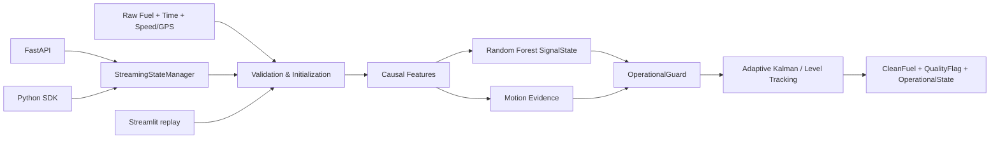

# VCOMSAT Fuel Signal Processing

Hệ thống lọc và làm mượt tín hiệu mức nhiên liệu theo thời gian thực cho dữ liệu
telematics. Pipeline tạo `CleanFuel` từ `RawFuel`, đồng thời trả về trạng thái tín
hiệu, hành động lọc và ngữ cảnh chuyển động để hệ thống phía sau tiếp tục phân tích.

> Phạm vi của dự án là **xử lý tín hiệu**. `UPWARD_SHIFT` và
> `DOWNWARD_SHIFT` chỉ mô tả dịch chuyển mặt bằng vật lý; chúng không đồng nghĩa
> chắc chắn với nạp nhiên liệu hoặc rút trộm.


## Trạng thái hiện tại

| Hạng mục | Trạng thái |
|---|---|
| Core realtime, API, SDK và dashboard dùng chung `AISmoothTrackingFilter` | Có |
| Inference causal: chỉ dùng điểm hiện tại và lịch sử đã phát hành | Có |
| Random Forest hiện có | Giữ nguyên, không retrain trong thay đổi operational gần nhất |
| Capacity mặc định giả `200 L` | Đã loại khỏi processing path |
| Dashboard tự gán capacity theo biển số | Đã loại bỏ; dashboard luôn truyền `None` |
| Khởi tạo từ điểm đầu tiên không hợp lệ thành `50 L` | Đã loại bỏ |
| OperationalGuard cho deep low-positive excursion và rebound | Đã tích hợp |
| Bộ test trọng yếu gần nhất | `43 passed` |
| Toàn bộ `tests/` gần nhất | `110 passed, 14 failed` — xem [Kiểm thử](#kiểm-thử-và-trạng-thái-regression) |

Trạng thái trên phản ánh working tree tại ngày **2026-09-11**, không phải một
release đã đóng dấu. Không nên công bố “all tests passed” cho tới khi các regression
còn lại được review.

## Mục lục

- [Phạm vi và nguyên tắc](#phạm-vi-và-nguyên-tắc)
- [Kiến trúc](#kiến-trúc)
- [Cấu trúc mã nguồn](#cấu-trúc-mã-nguồn)
- [Capacity và initialization](#capacity-và-initialization)
- [OperationalGuard và Adaptive Kalman](#operationalguard-và-adaptive-kalman)
- [API](#api)
- [Dashboard](#dashboard)
- [Chạy local](#chạy-local)
- [Docker](#docker)
- [State và concurrency](#state-và-concurrency)
- [Kiểm thử](#kiểm-thử-và-trạng-thái-regression)
- [Giới hạn đã biết](#giới-hạn-đã-biết)

## Phạm vi và nguyên tắc

Pipeline nhận mức nhiên liệu đã quy đổi sang lít cùng timestamp, vận tốc và GPS
tùy chọn. Mỗi điểm được xử lý ngay theo thứ tự thời gian của từng xe.

Các nguyên tắc chính:

- Không dùng centered rolling, future sample hoặc backfill output.
- Không quay lại sửa `CleanFuel` đã phát hành.
- State được tách theo `VehicleID` trong core và service.
- Random Forest cung cấp bằng chứng phân loại cục bộ; guard deterministic có thể
  giữ hoặc ghi đè hành động tracking để bảo vệ output.
- Speed và GPS là ngữ cảnh chuyển động, không phải ground truth nghiệp vụ.
- Capacity không được suy ra từ `RawFuel`, giá trị lớn nhất của file hoặc một
  default giả.
- Ground Truth và model RF không được tự ý sửa để làm regression pass.

### Causal inference

`CausalFeatureExtractor` chỉ đọc state quá khứ của đúng xe và điểm hiện tại. Model
metadata cũ vẫn chứa các tên cột tương thích như `FutureMedian3` và
`FutureMedian5`; tại inference, các trường này được điền bằng thống kê causal hiện
tại/quá khứ, không đọc hàng tương lai.

Dashboard cũng chạy cùng engine causal. Nó replay từ đầu từng `SegmentID`, sau đó
mới cắt khoảng ngày để hiển thị. Vì vậy đổi khoảng hiển thị không làm reset hoặc
thay đổi lịch sử trước đó của bộ lọc.

## Kiến trúc



Luồng triển khai:

1. API hoặc SDK chuẩn hóa request.
2. `StreamingStateManager` khóa theo `VehicleID`, lấy capacity đáng tin nếu có và
   khôi phục state.
3. `AISmoothTrackingFilter` xử lý đúng một điểm.
4. `CausalFeatureExtractor` tạo đặc trưng và motion evidence.
5. RF dự đoán `SignalState` nếu model khả dụng.
6. `OperationalGuard` bảo vệ deep excursion/rebound trước các nhánh tracking cũ.
7. Adaptive Kalman hoặc level-shift branch tạo `CleanFuel`.
8. State được lưu và response được trả về.

## Cấu trúc mã nguồn

```text
src/
├── core/filters/
│   ├── smooth_tracking/
│   │   ├── config.py              # Tham số versioned
│   │   ├── contracts.py           # SignalState, QualityFlag, MotionState
│   │   ├── dataframe.py           # Adapter DataFrame causal
│   │   ├── engine.py              # AISmoothTrackingFilter
│   │   ├── features.py            # Đặc trưng causal và motion evidence
│   │   ├── kalman.py              # Adaptive Kalman 1D
│   │   ├── operational_guard.py   # Deep excursion, rebound, recovery
│   │   └── state.py               # VehicleFilterContext
│   ├── ai_smooth_tracking_filter.py      # Facade tương thích
│   └── ai_enhanced_adaptive_realtime.py  # Bộ lọc đối chứng
├── dashboard/
│   ├── app_dashboard_tienxuly.py
│   └── dashboard_data.py
├── service/
│   ├── api.py
│   ├── queue_manager.py
│   ├── state_manager.py
│   └── state_store.py
├── sdk/fuel_cleaner.py
└── db/
    ├── database.py
    └── models.py

models/fuel_state_classifier/      # Random Forest và metadata
tests/                             # Unit, API, concurrency và golden tests
scripts/                           # Đánh giá KPI và sinh báo cáo
docs/                              # Tài liệu bổ sung
Dockerfile
docker-compose.yml
requirements.txt
requirements-dashboard.txt
```

Các entry point quan trọng:

- Core: [`src/core/filters/smooth_tracking/engine.py`](src/core/filters/smooth_tracking/engine.py)
- Operational guard: [`src/core/filters/smooth_tracking/operational_guard.py`](src/core/filters/smooth_tracking/operational_guard.py)
- Cấu hình: [`src/core/filters/smooth_tracking/config.py`](src/core/filters/smooth_tracking/config.py)
- API: [`src/service/api.py`](src/service/api.py)
- Dashboard: [`src/dashboard/app_dashboard_tienxuly.py`](src/dashboard/app_dashboard_tienxuly.py)
- API chi tiết: [`docs/API_DOCUMENTATION.md`](docs/API_DOCUMENTATION.md)

## Capacity và initialization

### CapacityMode

Capacity có hai mode và ba nguồn:

| Mode | Source | Ý nghĩa |
|---|---|---|
| `KNOWN` | `MASTER_DATA` | Capacity hợp lệ lấy từ `vehicles.capacity_liters` |
| `KNOWN` | `REQUEST` | Không có master data, request cung cấp capacity hợp lệ |
| `UNKNOWN` | `NONE` | Không có capacity đáng tin; đây là mode hợp lệ, không phải lỗi |

Thứ tự ưu tiên của realtime service:

```text
MASTER_DATA → REQUEST → UNKNOWN/NONE
```

Quy tắc bắt buộc:

- Không có fallback `200 L`, `30 L` hoặc `850 L`.
- Không dùng `RawFuel × 1.05`, `RawFuel × 1.25` hoặc max của file làm physical
  capacity.
- Giá trị DB `850 L` được xem là placeholder legacy và không được coi là
  master-data đáng tin.
- Dashboard không cung cấp capacity và luôn chạy `UNKNOWN/NONE`.
- Nếu capacity xuất hiện giữa stream, mode đổi từ `UNKNOWN` sang `KNOWN` từ điểm
  hiện tại; Kalman và lịch sử không bị reset hoặc backfill.
- Khi capacity là `KNOWN`, engine vẫn có physical clamp ở
  `capacity × inferred_capacity_headroom` (mặc định `1.05`). Vì vậy caller chỉ
  được gửi capacity đã xác minh.

Threshold dùng capacity áp dụng `max(floor, ratio × capacity)` khi `KNOWN`; khi
`UNKNOWN`, core dùng safety floor và OperationalGuard bổ sung robust-noise
evidence. Không có capacity giả được tạo ra.

### Initialization

Trước khi xe được khởi tạo, các giá trị `<= 0`, `NaN`, `Inf` hoặc âm:

- không khởi tạo Kalman;
- không cập nhật raw/noise/trend history;
- trả `CleanFuel = null`;
- trả `SignalState = UNINITIALIZED`;
- trả `QualityFlag = INITIAL_INVALID_DISCARDED`.

Điểm dương hữu hạn đầu tiên mới là `INIT`:

```text
Raw:       0, 0, NaN, 85.4
Clean:  null, null, null, 85.4
State:                     INIT
```

Tại INIT, `kalman_x`, `last_raw_fuel`, `last_clean_fuel` và baseline ban đầu cùng
bằng điểm hợp lệ đầu tiên. Không sinh UP giả từ `0 → 85.4`.

Sau INIT, zero/invalid measurement được giữ bằng `ZERO_DROPOUT_HELD` và không kéo
Kalman về 0.

## OperationalGuard và Adaptive Kalman

### Deep low-positive excursion

Zero-only protection không đủ vì cảm biến có thể rơi về các giá trị dương rất
thấp. Guard mở `DOWN_EXCURSION` khi độ sâu vượt đồng thời ngưỡng phù hợp theo
baseline, robust noise và level-shift floor.

Các giá trị mặc định hiện tại:

| Tham số | Giá trị | Vai trò |
|---|---:|---|
| `extreme_excursion_baseline_ratio` | `0.30` | Bắt đầu bảo vệ khi rơi sâu so với baseline |
| `extreme_excursion_noise_multiplier` | `12.0` | So sánh với robust noise |
| `dropout_like_depth_ratio` | `0.70` | Gần mất toàn bộ mức đo: không accept chỉ dựa vào thời gian |
| `excursion_rebound_cancel_ratio` | `0.60` | Rebound đủ mạnh để chuyển recovery |
| `extreme_excursion_accept_minutes` | `60` phút | Bằng chứng thời gian tối thiểu cho excursion vừa phải |
| `excursion_plateau_points` | `4` | Cửa sổ causal kiểm tra plateau |
| `excursion_transition_minutes` | `12` phút | Scale chuyển mượt về baseline được chấp nhận |

Trong excursion:

- Published `CleanFuel` được hold để không rơi theo đáy nghi ngờ.
- Raw hiện tại vẫn được lưu làm bằng chứng causal cho hình dạng excursion.
- Nếu rebound đạt 0.60, guard chuyển `REBOUND_RECOVERY`; nhịp hồi không bị hiểu
  ngay thành một UP độc lập.
- Với drop gần toàn phần (`>= 70%` baseline), thời gian thấp đơn thuần không đủ để
  biến nó thành baseline thật. Guard chờ rebound hoặc reset state.
- Excursion vừa phải có thể được chấp nhận sau elapsed time, plateau ổn định và
  rebound thấp; output chuyển dần thay vì snap ngay.

Ví dụ được bảo vệ:

```text
Raw:   100, 20, 15, 12, 14, 18, 20, 70, 100
Clean: giữ gần baseline cũ; không tạo DOWN rồi UP giả
```

### UP mạnh và candidate memory

Candidate UP dùng bộ nhớ giới hạn và chỉ đánh giá cửa sổ gần nhất. Một ramp cũ
không thể làm `PENDING_UPWARD_SHIFT_HELD` mắc vô hạn.

Fast path xác nhận UP cần hai measurement cao liên tiếp, mức tăng đủ lớn so với
anchor và không pullback mạnh. Ví dụ replay Car 3:

```text
2026-07-07 06:05  Raw=203.2  → PENDING_UPWARD_SHIFT_HELD
2026-07-07 06:10  Raw=323.7  → UPWARD_SHIFT_TRACKED
```

### Adaptive Kalman

Kalman điều chỉnh `Q/R` theo motion context, classifier state và bằng chứng xu
hướng. Các giá trị chính trong cấu hình hiện tại:

| Ngữ cảnh | `R` | `Q` |
|---|---:|---:|
| Parked fallback | `35.0` | `0.03` |
| Moving fallback | `45.0` | `0.08` |
| Low motion có GPS | `28.0` | `0.06` |
| Strong bidirectional noise | `250.0` | `0.01` |
| Mild stable jitter | `18.0` | `0.12` |
| Directional change | `8.0` | `1.0` |
| Robust moving trend | `6.0` | `1.5` |

Mọi thay đổi Q/R phải thực hiện trong `SmoothTrackingConfig` và đi qua golden/KPI
review; dashboard không cho phép chỉnh trực tiếp.

### Trạng thái và cờ hiện có

`SignalState` chuẩn:

```text
UNINITIALIZED, INIT, STABLE_JITTER, OSCILLATION_NOISE, SLOSHING,
GRADUAL_CHANGE, UPWARD_SHIFT, DOWNWARD_SHIFT, SPIKE, UNCERTAIN
```

`OperationalState` tiêu biểu:

```text
UNINITIALIZED, STABLE, GRADUAL_TRACKING, DOWN_EXCURSION,
LOW_PLATEAU_UNCERTAIN, REBOUND_RECOVERY, PENDING_UPWARD,
PENDING_DOWNWARD, UPWARD_CONFIRMED, DOWNWARD_CONFIRMED,
BASELINE_REACQUISITION
```

`QualityFlag` hiện được public contract chấp nhận:

```text
INITIAL_INVALID_DISCARDED, VALID, SMOOTH_KALMAN,
ZERO_DROPOUT_HELD, SPIKE_HELD,
PENDING_UPWARD_SHIFT_HELD, UPWARD_SHIFT_TRACKED,
UPWARD_REVERSAL_REJECTED, UPWARD_REVERSAL_RESET,
PENDING_DOWNWARD_SHIFT_HELD, DOWNWARD_SHIFT_TRACKED,
DOWN_EXCURSION_HELD, REBOUND_RECOVERY_HELD,
DOWNWARD_SHIFT_TRANSITION, STABLE_LEVEL_TRACKING
```

## API

FastAPI entry point: `src.service.api:app`. Swagger UI mặc định tại
`http://localhost:8000/docs`.

### Endpoint chính

| Method | Endpoint | Mục đích |
|---|---|---|
| `GET` | `/api/v1/health` | Health, model, database và state-store status |
| `POST` | `/api/v1/clean` | Enterprise aliases (`vehicle_id`, `timestamp`, `raw_fuel`, ...) |
| `POST` | `/api/v1/clean-batch` | Batch theo schema enterprise |
| `POST` | `/api/v1/fuel/clean-point` | Schema telemetry chuẩn `VehicleID/FuelTime/FuelLevel` |
| `POST` | `/api/v1/fuel/clean-batch` | Batch một xe; server sort theo `FuelTime` |
| `GET` | `/api/v1/vehicles` | Context xe đang active |
| `POST` | `/api/v1/vehicles/{vehicle_id}/reset-state` | Reset filter state và live buffer của xe |

Các endpoint `/api/*` khác trong `api.py` phục vụ live demo/history và nên được
xem là integration/legacy surface, không phải contract lọc tối thiểu.

### Input contract

| Trường | Bắt buộc | Ghi chú |
|---|:---:|---|
| `VehicleID` | Có | ID/biển số; state được tách theo giá trị này |
| `FuelTime` | Có | ISO-8601 datetime |
| `FuelLevel` | Có | Raw đã quy đổi sang lít |
| `Speed` | Không | km/h, mặc định 0 |
| `Lat`, `Lng` | Không | `(0, 0)` được coi là thiếu |
| `CapacityEst` | Không | Chỉ gửi khi đã xác minh |
| `segment_id` | Không | Hiện được nhận để tương thích nhưng realtime manager chưa dùng để reset |

Ví dụ:

```bash
curl -X POST "http://localhost:8000/api/v1/fuel/clean-point" \
  -H "Content-Type: application/json" \
  -d '{
    "VehicleID": "92H-03625",
    "FuelTime": "2026-09-11T10:00:00",
    "FuelLevel": 519.8,
    "Speed": 35.0,
    "Lat": 21.0285,
    "Lng": 105.8542
  }'
```

Response chính:

```json
{
  "VehicleID": "92H-03625",
  "FuelTime": "2026-09-11T10:00:00",
  "RawFuel": 519.8,
  "CleanFuel": 519.8,
  "SignalState": "INIT",
  "Confidence": 1.0,
  "QualityFlag": "VALID",
  "LatencyMs": 1.2,
  "MotionState": "UNCERTAIN",
  "MotionConfidence": 0.0,
  "GpsDisplacementMeters": 0.0
}
```

Giá trị latency chỉ mang tính minh họa. Response HTTP hiện không expose
`CapacityMode`, `CapacitySource` và `OperationalState`; các trường này có trong
core/state-manager result và dashboard diagnostics.

### API key

Mặc định `REQUIRE_API_KEY=false`. Khi bật, gửi một trong hai header:

```text
X-API-Key: <API_KEY>
Authorization: Bearer <API_KEY>
```

Không dùng secret mặc định trong production.

### Python SDK

```python
from src.sdk.fuel_cleaner import FuelCleanerEngine

cleaner = FuelCleanerEngine()
result = cleaner.clean_point(
    vehicle_id="92H-03625",
    timestamp="2026-09-11T10:00:00",
    raw_fuel=519.8,
    speed=35.0,
    capacity_est=None,
)

print(result["clean_fuel"], result["signal_state"])
```

## Dashboard

Dashboard là công cụ R&D để quan sát replay, không phải một thuật toán khác.

- Dùng cùng `AISmoothTrackingFilter` với API/SDK.
- Hỗ trợ thư mục `fulltt`, workbook `Thunghiem5/CarFuelHistory.xlsx` hoặc cả hai.
- Vẽ RawFuel, AI Smooth-Tracking, speed và rolling standard deviation.
- Có Data Inspector cho state và quality flag theo từng điểm.
- Tách context theo `VehicleID + SegmentID` khi replay.
- Không cung cấp capacity; sidebar hiển thị `Capacity: UNKNOWN`.
- Không được đóng gói trong Docker API; dependency nằm ở
  `requirements-dashboard.txt`.

```powershell
streamlit run src/dashboard/app_dashboard_tienxuly.py
```

Sau khi sửa engine hoặc config, dừng/chạy lại Streamlit. Dashboard có pipeline
version trong cache key, nhưng restart process vẫn là cách chắc chắn để loại bỏ
state/cache cũ.

## Chạy local

### Yêu cầu

- Python 3.10 hoặc 3.11 được khuyến nghị; Docker dùng Python 3.11.
- Windows, Linux hoặc macOS.

### Cài API/core

```powershell
python -m venv .venv
.\.venv\Scripts\Activate.ps1
python -m pip install --upgrade pip
python -m pip install -r requirements.txt
```

Linux/macOS dùng `source .venv/bin/activate`.

### Cài thêm dashboard

```powershell
python -m pip install -r requirements-dashboard.txt
```

### Khởi chạy API

```powershell
python -m uvicorn src.service.api:app --host 0.0.0.0 --port 8000 --reload
```

Hoặc trên Windows:

```powershell
.\run_enterprise.bat
```

Linux/macOS:

```bash
./run_enterprise.sh
```

### Kiểm tra nhanh

```powershell
curl http://localhost:8000/api/v1/health
```

## Docker

Docker runtime được thiết kế cho API. Image không cài Streamlit/Plotly và không
copy các tập dữ liệu replay; dù thư mục `src/dashboard` nằm trong source tree,
dashboard không phải entry point được hỗ trợ trong container này.

```powershell
docker compose build fuel-api
docker compose up -d fuel-api
docker compose logs -f fuel-api
```

Chạy cùng Redis:

```powershell
docker compose --profile redis up -d
```

Nếu đang phát triển local bằng `.venv`, không cần rebuild Docker. Máy khác nhận
source mới phải build image mới ít nhất một lần; chạy lại image cũ sẽ không có
thay đổi thuật toán.

### Biến môi trường

| Biến | Mặc định | Ý nghĩa |
|---|---|---|
| `PORT` | `8000` | Port publish bởi Compose |
| `DATABASE_URL` | Local: `sqlite:///./fuel_records.db`; Compose: `sqlite:////app/fuel_data/fuel_records.db` | Database hoặc `NONE` |
| `REQUIRE_API_KEY` | `false` | Bật xác thực API key |
| `API_KEY` | Giá trị demo trong `.env.example` | Secret khi bật xác thực |
| `STATE_BACKEND` | `memory` | `memory` hoặc `redis` |
| `REDIS_URL` | Tùy môi trường | Redis connection URL |
| `STATE_TTL_SECONDS` | `259200` | TTL state, mặc định 72 giờ |

Không commit `.env` chứa credential thật.

## State và concurrency

- `StreamingStateManager` dùng lock riêng theo `VehicleID`.
- `VehicleQueueManager` bảo đảm FIFO cho từng xe; các xe khác nhau có thể xử lý
  đồng thời.
- Backend mặc định là memory.
- Redis dùng JSON versioned và có memory fallback khi primary lỗi.
- Khi deploy thuật toán/state schema mới, nên reset state cũ của xe trước khi nhận
  stream tiếp theo.

Reset một xe:

```bash
curl -X POST http://localhost:8000/api/v1/vehicles/92H-03625/reset-state
```

Engine hiện reset Kalman khi time gap vượt `reset_gap_minutes = 120`. Dashboard
tách context khi `SegmentID` đổi. Realtime API hiện chưa dùng `segment_id` để reset;
xem phần giới hạn bên dưới.

## Kiểm thử và trạng thái regression

Chạy suite chính thức:

```powershell
.\.venv\Scripts\python.exe -m pytest -q tests
```

Chạy nhóm trọng yếu đã xác minh sau thay đổi capacity/OperationalGuard:

```powershell
.\.venv\Scripts\python.exe -m pytest -q `
  tests/test_smooth_tracking_noise_symmetry.py `
  tests/test_dashboard_topic1.py `
  tests/test_capacity_initialization.py `
  tests/test_motion_quality_context.py `
  tests/test_purple_service_unification.py `
  tests/test_topic1_api_contract.py `
  tests/test_concurrent_streaming.py
```

Kết quả gần nhất:

```text
Nhóm trọng yếu: 43 passed
Toàn bộ tests/: 110 passed, 14 failed
```

Các failure đang chờ review:

1. Một test export history gọi `float(None)` khi điểm chưa tạo được CleanFuel.
2. Một số golden fixture truyền `capacity_est_liters=200` trong khi RawFuel thực
   tế trên 400–500 L. Với semantics mới, đây là capacity `KNOWN/REQUEST` sai và
   physical clamp tạo kết quả 210 L.
3. Một số snapshot U/GPS lệch nhỏ sau OperationalGuard mới.

Không cập nhật golden snapshot cho tới khi xác minh expected cũ hay output mới hợp
lý hơn. `pytest` ở root còn collect ba script legacy trong `TestDoDoc/` đang import
module `src.core.filters.ai_state_filter` không tồn tại; dùng `pytest tests` cho
suite chính thức cho tới khi các script đó được chuyển khỏi test discovery hoặc
được sửa.

## Giới hạn đã biết

1. **Causal ambiguity:** một mức thấp kéo dài có thể là baseline thật hoặc sensor
   excursion. Không có future/ACC/IMU/flow meter thì không thể phân biệt tuyệt đối
   tại điểm đầu tiên.
2. **Deep dropout policy:** drop tức thời từ 70% baseline trở lên được giữ cho tới
   rebound hoặc reset. Đây là lựa chọn an toàn cho sensor-floor dropout nhưng có
   thể làm chậm một physical shift cực lớn thật sự.
3. **Segment reset trong API:** schema nhận `segment_id`, nhưng
   `StreamingStateManager` hiện bỏ qua trường này. Dashboard vẫn reset đúng theo
   segment.
4. **Time-gap reset:** giá trị code hiện tại là 120 phút, chưa phải 30 phút.
5. **Redis operational state:** serializer hiện lưu Kalman và history cơ bản nhưng
   chưa lưu đầy đủ các field excursion/recovery mới. Restart/eviction giữa một
   excursion chưa bảo đảm tương đương memory backend.
6. **Out-of-order single point:** endpoint batch sort theo timestamp; single-point
   path chưa reject rõ bản tin cũ hơn điểm gần nhất.
7. **Capacity sai từ caller:** request capacity hợp lệ về kiểu dữ liệu được coi là
   `KNOWN`. Nếu giá trị vật lý sai, clamp và threshold cũng sai.
8. **Không có Ground Truth tuyệt đối:** CleanFuel là ước lượng tín hiệu, không phải
   phép đo thể tích chuẩn phòng thí nghiệm.

## Tài liệu bổ sung

- [API documentation](docs/API_DOCUMENTATION.md)
- [Tổng quan tiền xử lý và bộ lọc](docs/tong_quan_tien_xu_ly_va_bo_loc.md)
- [Xử lý sụt cảm biến chữ U](docs/xu_ly_sut_cam_bien_chu_u_va_noi_suy.md)
- [RF signal-state data split](docs/rf_signal_state_v1_data_split.md)
- [Golden fixture guide](tests/fixtures/README.md)

## Quy tắc đóng góp

- Không retrain RF hoặc sửa Ground Truth trong một thay đổi operational nếu chưa
  có yêu cầu và review riêng.
- Không hard-code logic cứu một `VehicleID`.
- Mọi thay đổi filter phải có test causal và replay dữ liệu liên quan.
- Không cập nhật snapshot chỉ để làm test xanh.
- Ghi rõ thay đổi contract/state schema và hướng dẫn reset state khi deploy.
