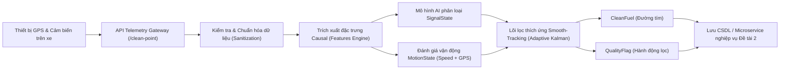
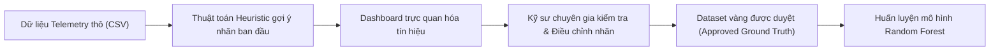
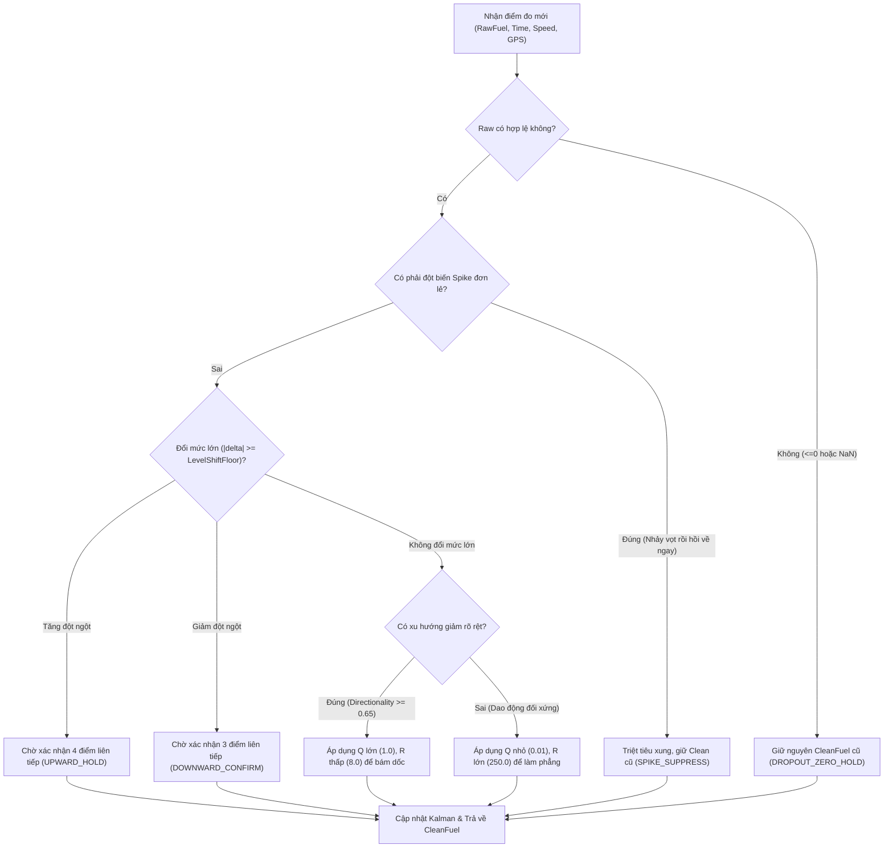
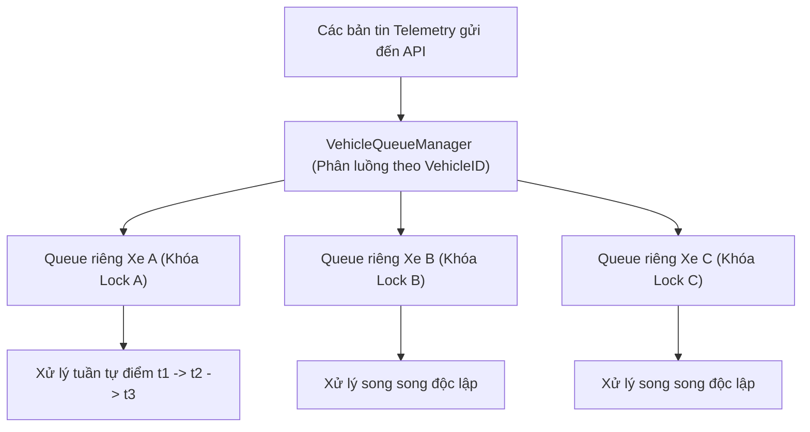

# VICOMSAT — Real-time Fuel Data Denoising & Filtering (Đề tài 1)

Hệ thống lọc và làm mượt tín hiệu mức nhiên liệu theo thời gian thực cho dữ liệu
telematics. Pipeline tạo `CleanFuel` từ `RawFuel`, đồng thời trả về trạng thái tín
hiệu, hành động lọc và ngữ cảnh chuyển động để hệ thống phía sau tiếp tục phân tích.

> Phạm vi của dự án là **xử lý tín hiệu**. `UPWARD_SHIFT` và
> `DOWNWARD_SHIFT` chỉ mô tả dịch chuyển mặt bằng vật lý; chúng không đồng nghĩa
> chắc chắn với nạp nhiên liệu hoặc rút trộm.


## Trạng thái hiện tại

| Hạng mục | Trạng thái |
|---|---|
| Core realtime, API, SDK và dashboard dùng chung `AISmoothTrackingFilter` | Có |
| Inference causal: chỉ dùng điểm hiện tại và lịch sử đã phát hành | Có |
| Random Forest hiện có | Giữ nguyên, không retrain trong thay đổi operational gần nhất |
| Capacity mặc định giả `200 L` | Đã loại khỏi processing path |
| Dashboard tự gán capacity theo biển số | Đã loại bỏ; dashboard luôn truyền `None` |
| Khởi tạo từ điểm đầu tiên không hợp lệ thành `50 L` | Đã loại bỏ |
| OperationalGuard cho deep low-positive excursion và rebound | Đã tích hợp |
| Bộ test trọng yếu gần nhất | `43 passed` |
| Toàn bộ `tests/` gần nhất | `110 passed, 14 failed` — xem [Kiểm thử](#kiểm-thử-và-trạng-thái-regression) |

```text
Ví dụ khử nhiễu thực tế (Xe dừng nổ máy, cảm biến rung lắc):
RawFuel (Thô):     300.0 L ──> 280.0 L ──> 279.0 L ──> 281.0 L ──> 300.0 L
CleanFuel (Tím):   300.0 L ──> 300.0 L ──> 300.0 L ──> 300.0 L ──> 300.0 L
QualityFlag:       INITIAL ──> VALLEY_HOLD ──> VALLEY_HOLD ──> VALLEY_HOLD ──> RECOVERY_SMOOTH
```

- [Phạm vi và nguyên tắc](#phạm-vi-và-nguyên-tắc)
- [Kiến trúc](#kiến-trúc)
- [Cấu trúc mã nguồn](#cấu-trúc-mã-nguồn)
- [Capacity và initialization](#capacity-và-initialization)
- [OperationalGuard và Adaptive Kalman](#operationalguard-và-adaptive-kalman)
- [API](#api)
- [Dashboard](#dashboard)
- [Chạy local](#chạy-local)
- [Docker](#docker)
- [State và concurrency](#state-và-concurrency)
- [Kiểm thử](#kiểm-thử-và-trạng-thái-regression)
- [Giới hạn đã biết](#giới-hạn-đã-biết)

## Phạm vi và nguyên tắc

Pipeline nhận mức nhiên liệu đã quy đổi sang lít cùng timestamp, vận tốc và GPS
tùy chọn. Mỗi điểm được xử lý ngay theo thứ tự thời gian của từng xe.

Các nguyên tắc chính:

- Không dùng centered rolling, future sample hoặc backfill output.
- Không quay lại sửa `CleanFuel` đã phát hành.
- State được tách theo `VehicleID` trong core và service.
- Random Forest cung cấp bằng chứng phân loại cục bộ; guard deterministic có thể
  giữ hoặc ghi đè hành động tracking để bảo vệ output.
- Speed và GPS là ngữ cảnh chuyển động, không phải ground truth nghiệp vụ.
- Capacity không được suy ra từ `RawFuel`, giá trị lớn nhất của file hoặc một
  default giả.
- Ground Truth và model RF không được tự ý sửa để làm regression pass.

### Causal inference

`CausalFeatureExtractor` chỉ đọc state quá khứ của đúng xe và điểm hiện tại. Model
metadata cũ vẫn chứa các tên cột tương thích như `FutureMedian3` và
`FutureMedian5`; tại inference, các trường này được điền bằng thống kê causal hiện
tại/quá khứ, không đọc hàng tương lai.

Dashboard cũng chạy cùng engine causal. Nó replay từ đầu từng `SegmentID`, sau đó
mới cắt khoảng ngày để hiển thị. Vì vậy đổi khoảng hiển thị không làm reset hoặc
thay đổi lịch sử trước đó của bộ lọc.

## Kiến trúc



### 2.2. Chi tiết chức năng 8 tầng xử lý
1. **Tầng tiếp nhận (Ingestion Gateway)**: Nhận bản tin JSON qua REST API (`/api/v1/fuel/clean-point` hoặc `/clean-batch`), kiểm tra API Key và đẩy vào hàng đợi đơn luồng theo từng xe (`VehicleQueueManager`).
2. **Tầng chuẩn hóa (Sanitization & Validation)**: Kiểm tra định dạng thời gian ISO-8601, loại bỏ tọa độ GPS không hợp lệ (như `0, 0`), phát hiện giá trị âm, rớt về 0 hoặc vượt trần dung tích bình (`CapacityEst`).
3. **Tầng xác định vận động (Motion Assessment)**: Kết hợp vận tốc tức thời và bán kính dịch chuyển GPS trong cửa sổ trượt 5 điểm gần nhất để gán nhãn trạng thái vận động (`MOVING`, `LOW_MOTION`, `UNCERTAIN`).
4. **Tầng trích xuất đặc trưng (Causal Feature Extraction)**: Tính toán độ biến thiên, độ lệch chuẩn trượt, hướng dốc và điểm phân kỳ chỉ từ dữ liệu quá khứ.
5. **Tầng phân loại tín hiệu AI (AI Signal State Classifier)**: Mô hình Random Forest sử dụng vector đặc trưng để phân loại dạng tín hiệu thành 8 nhãn kỹ thuật.
6. **Tầng lọc thích ứng Smooth-Tracking (Adaptive Kalman Core)**: Điều chỉnh động hiệp phương sai nhiễu đo $R$ và nhiễu hệ thống $Q$ dựa trên kết hợp giữa `SignalState`, `MotionState` và dung tích xe.
7. **Tầng quản lý trạng thái xe (Vehicle State Store)**: Đóng gói và lưu vết State Context của xe (Kalman state, lịch sử đệm, bộ đếm xác nhận) vào RAM hoặc Redis (có khóa an toàn chống Race Condition).
8. **Tầng xuất dữ liệu (Contract Delivery)**: Trả về kết quả JSON đồng nhất bao gồm giá trị sạch, cờ chất lượng và độ trễ tính toán (Latency).

1. API hoặc SDK chuẩn hóa request.
2. `StreamingStateManager` khóa theo `VehicleID`, lấy capacity đáng tin nếu có và
   khôi phục state.
3. `AISmoothTrackingFilter` xử lý đúng một điểm.
4. `CausalFeatureExtractor` tạo đặc trưng và motion evidence.
5. RF dự đoán `SignalState` nếu model khả dụng.
6. `OperationalGuard` bảo vệ deep excursion/rebound trước các nhánh tracking cũ.
7. Adaptive Kalman hoặc level-shift branch tạo `CleanFuel`.
8. State được lưu và response được trả về.

## Cấu trúc mã nguồn

```text
D:\THUCTAP_VICOMSAT\
├── src/
│   ├── core/                                # Lõi xử lý tín hiệu và thuật toán
│   │   └── filters/
│   │       ├── smooth_tracking/             # MODULE LÕI ĐƯỜNG TÍM CHÍNH THỨC
│   │       │   ├── __init__.py              # Export engine và cấu hình chuẩn
│   │       │   ├── config.py                # Toàn bộ tham số cấu hình Q, R, ngưỡng
│   │       │   ├── contracts.py             # Kiểu dữ liệu và định dạng đầu ra
│   │       │   ├── dataframe.py             # Hỗ trợ chạy batch DataFrame cho kiểm thử
│   │       │   ├── engine.py                # Lõi điều phối chính (SmoothTrackingFilterEngine)
│   │       │   ├── features.py              # Trích xuất 15 đặc trưng causal
│   │       │   ├── kalman.py                # Triển khai thuật toán Adaptive Kalman 1D
│   │       │   └── state.py                 # Cấu trúc lưu trạng thái bộ đếm từng xe
│   │       ├── ai_smooth_tracking_filter.py # Lớp bọc tương thích ngược (Backward Compatibility)
│   │       └── ai_state_filter.py           # Module hỗ trợ phân loại tín hiệu
│   ├── service/                             # Microservice REST API & State Backend
│   │   ├── api.py                           # ENTRY POINT REST API chính (FastAPI)
│   │   ├── queue_manager.py                 # Quản lý hàng đợi FIFO tuần tự theo từng xe
│   │   ├── state_manager.py                 # Điều phối lưu trữ RAM / Redis state
│   │   └── state_store.py                   # Lớp trừu tượng hóa Storage (Memory/Redis)
│   ├── sdk/
│   │   └── fuel_cleaner.py                  # Python SDK nhúng trực tiếp không qua HTTP
│   ├── dashboard/
│   │   └── app_dashboard_tienxuly.py        # Giao diện Streamlit kiểm tra trực quan
│   └── pipeline/
│       └── train_fuel_state_classifier.py   # Pipeline huấn luyện mô hình AI offline
├── models/                                  # Trọng số mô hình AI
│   └── rf_signal_state_causal_v3/
│       ├── fuel_state_classifier.pkl        # Model Random Forest chính thức
│       └── metadata.json                    # Danh sách thứ tự đặc trưng và siêu tham số
├── tests/                                   # Bộ kiểm thử tự động (83 tests)
│   ├── fixtures/
│   │   ├── golden_fuel_segments.json        # 8 đoạn dữ liệu vàng thực tế từ xe chạy
│   │   └── README.md                        # Hướng dẫn quy trình review golden segment
│   ├── test_real_data_golden_segments.py    # Kiểm thử hồi quy golden segment
│   ├── test_concurrent_streaming.py         # Kiểm thử an toàn đa luồng và thứ tự FIFO
│   ├── test_motion_quality_context.py       # Kiểm thử xác định chuyển động Speed + GPS
│   └── test_purple_service_unification.py   # Kiểm thử đồng nhất giữa API, SDK và Engine
├── scripts/
│   ├── evaluate_smooth_tracking.py          # Script tự động tính toán KPI và xuất báo cáo
│   └── find_golden_candidates.py            # Công cụ trích xuất đoạn dữ liệu thực tế làm fixture
├── artifacts/
│   └── evaluation/                          # Báo cáo KPI, metrics.json, report.md
├── docs/                                    # Tài liệu chi tiết mở rộng
│   └── API_DOCUMENTATION.md                 # Đặc tả chi tiết các REST API endpoints
├── Dockerfile                               # Đóng gói Microservice chuẩn sản xuất
├── docker-compose.yml                       # Khởi chạy 1-click kèm Redis
└── requirements.txt                         # Danh sách thư viện phụ thuộc
```

Các entry point quan trọng:

- Core: [`src/core/filters/smooth_tracking/engine.py`](src/core/filters/smooth_tracking/engine.py)
- Operational guard: [`src/core/filters/smooth_tracking/operational_guard.py`](src/core/filters/smooth_tracking/operational_guard.py)
- Cấu hình: [`src/core/filters/smooth_tracking/config.py`](src/core/filters/smooth_tracking/config.py)
- API: [`src/service/api.py`](src/service/api.py)
- Dashboard: [`src/dashboard/app_dashboard_tienxuly.py`](src/dashboard/app_dashboard_tienxuly.py)
- API chi tiết: [`docs/API_DOCUMENTATION.md`](docs/API_DOCUMENTATION.md)

## Capacity và initialization

### CapacityMode

Capacity có hai mode và ba nguồn:

| Mode | Source | Ý nghĩa |
|---|---|---|
| `KNOWN` | `MASTER_DATA` | Capacity hợp lệ lấy từ `vehicles.capacity_liters` |
| `KNOWN` | `REQUEST` | Không có master data, request cung cấp capacity hợp lệ |
| `UNKNOWN` | `NONE` | Không có capacity đáng tin; đây là mode hợp lệ, không phải lỗi |

### 4.2. Các quy ước bắt buộc khi vận hành
1. **Đơn vị chuẩn hóa**: Dữ liệu cảm biến truyền vào phải được tính bằng **Lít**. Hệ thống không nhận giá trị ADC/Volt thô chưa qua bảng hiệu chuẩn (Calib).
2. **Thứ tự thời gian (Chronological Order)**: Các điểm đo của cùng một `VehicleID` phải được gửi đến theo đúng thứ tự thời gian tăng dần (`FuelTime[t] >= FuelTime[t-1]`). Nếu điểm gửi tới có thời gian cũ hơn điểm cuối đã xử lý, hệ thống sẽ đánh dấu `ORDER_VIOLATION` và giữ nguyên mức nhiên liệu sạch.
3. **Phân lập trạng thái theo xe**: Mỗi `VehicleID` sở hữu một State Context độc lập hoàn toàn. Dữ liệu của xe 29E-45520 tuyệt đối không ảnh hưởng tới trạng thái lọc của xe 21H-02058.
4. **Tọa độ GPS không hợp lệ**: Cặp tọa độ `(0.0, 0.0)` hoặc tọa độ ngoài dải địa lý Việt Nam được xem là lỗi vệ tinh và bị loại bỏ khỏi tính toán cự ly.
5. **Cơ chế tự suy luận `CapacityEst`**:
   - Nếu doanh nghiệp truyền `CapacityEst`, hệ thống sẽ sử dụng giá trị này để định tỷ lệ các ngưỡng lọc (Spike, Jitter, Sloshing).
   - Nếu không truyền hoặc truyền giá trị `<= 30.0 L`, hệ thống sẽ tự suy luận tạm thời từ điểm nhiên liệu hợp lệ đầu tiên: `CapacityEst = RawFuel * 1.05 (mặc định nếu không truyền)` (tối thiểu `200.0 L`). Khi phát hiện `RawFuel` vượt dung tích tạm, hệ thống tự động co giãn ngưỡng lên để thích ứng.

---

## 5. Quy trình tiền xử lý dữ liệu (Sanitization & Segmentation)

### 5.1. Chuẩn hóa dữ liệu đầu vào (Sanitization)
- **Parse thời gian chặt chẽ**: Toàn bộ chuỗi thời gian được chuẩn hóa về định dạng ISO-8601. Các bản ghi sai định dạng hoặc mốc thời gian không hợp lệ bị từ chối ngay tại tầng API.
- **Ép kiểu an toàn**: Chuyển đổi các giá trị số thực (`float`), loại bỏ chuỗi rác.
- **Không nội suy tương lai trong chế độ Real-time**: Tuyệt đối không sử dụng các kỹ thuật như Spline nội suy hay Rolling Center Window vốn đòi hỏi biết trước dữ liệu tương lai. Mọi phép xử lý chỉ được nhìn thấy $t \le t_{hiện\_tại}$.

### 5.2. Kiểm tra tính hợp lệ và xử lý biên (Validation Rules)
1. **Raw bằng 0 (`RawFuel == 0.0`)**: Được nhận diện là mất tín hiệu nguồn cảm biến (Zero Dropout). Hệ thống kích hoạt trạng thái giữ nguyên mức sạch trước đó (`DROPOUT_ZERO_HOLD`).
2. **Raw âm (`RawFuel < 0.0`) hoặc giá trị `NaN`**: Được xem là lỗi dữ liệu đường truyền. Bộ lọc bỏ qua giá trị đo này và duy trì mức cũ với cảnh báo `INVALID_INPUT`.
3. **Raw vượt giới hạn vật lý (`RawFuel > CapacityEst * 1.02`)**: Xử lý như giá trị cực đại bất thường, không cập nhật Kalman trực tiếp mà đưa vào nhánh kiểm tra đột biến.
4. **Bản tin tới trễ / Sai thứ tự**: Điểm đo có thời gian nhỏ hơn thời gian gần nhất của xe sẽ bị bỏ qua và giữ nguyên mức Clean.
5. **GPS nhảy cóc (GPS Glitch)**: Khi vận tốc xe báo `0.0 km/h` nhưng tọa độ GPS cách điểm trước > 100 mét chỉ trong vài giây, hệ thống xếp vào trạng thái `UNCERTAIN` và tăng hệ số thận trọng của bộ lọc.

### 5.3. Phân đoạn dữ liệu (Segmentation) & Reset State
- **Quy tắc đứt quãng 30 phút**: Nếu khoảng cách thời gian giữa 2 bản tin liên tiếp $\Delta t > 30\text{ phút}$ (tham số `reset_gap_minutes = 30.0`), hệ thống xác định xe đã trải qua thời gian nghỉ dài không giám sát.
- **Hành vi Reset State**:
  - Xóa trắng bộ đệm lịch sử của xe.
  - Khởi tạo lại bộ lọc Kalman với giá trị đo mới: $x_0 = \text{RawFuel}$, $P_0 = 1.0$.
  - Tránh hiện tượng kéo mượt một đường thẳng giả tạo nối giữa hai thời điểm cách nhau nhiều giờ.
- **Khái niệm Burn-in (Chạy rà)**: Khi hệ thống khởi động lại hoặc khi hiển thị một đoạn dữ liệu lịch sử trên Dashboard, bộ lọc cần khoảng **5 – 10 điểm đầu tiên** để hiệp phương sai $P$ hội tụ về trạng thái ổn định. Trong giai đoạn burn-in, các cờ chất lượng được đánh dấu `INITIAL_LOCK`.

---

## 6. Phân tích và gắn nhãn dữ liệu (AI Data Labeling)

### 6.1. Danh sách 8 nhãn trạng thái tín hiệu (`SignalState`)

| Tên nhãn | Định nghĩa kỹ thuật | Hiện tượng vật lý thực tế |
| :--- | :--- | :--- |
| `STABLE_JITTER` | Dao động biên độ nhỏ quanh mức trung bình tĩnh ($\le 0.8\text{ L}$). | Xe dừng nổ máy, hoặc cảm biến rung cơ học khi đỗ. |
| `OSCILLATION_NOISE` | Dao động nhiễu tần số cao, đổi hướng liên tục không có xu thế. | Xe đi qua ổ gà, gờ giảm tốc liên tục. |
| `SLOSHING` | Sóng sánh nhiên liệu chu kỳ 10–30s, độ lệch lớn nhưng đối xứng. | Nhiên liệu dồn về trước/sau khi phanh hoặc tăng tốc. |
| `GRADUAL_CHANGE` | Mức nhiên liệu giảm hoặc tăng từ từ và đều đặn theo thời gian. | Tiêu hao nhiên liệu bình thường khi động cơ hoạt động. |
| `UPWARD_SHIFT` | Mặt bằng tín hiệu dịch chuyển tăng đột ngột và duy trì mức mới. | Mức đo tăng bền vững (có thể do nạp hoặc phao kẹt). |
| `DOWNWARD_SHIFT` | Mặt bằng tín hiệu dịch chuyển giảm đột ngột và duy trì mức mới. | Mức đo sụt bền vững (có thể do rút dầu hoặc trượt phao). |
| `SPIKE` | 1–2 điểm đo nhảy vọt hoặc sụt nhọn bất thường rồi về nền cũ. | Nhiễu xung điện từ, chạm mass dây dẫn cảm biến. |
| `UNCERTAIN` | Tín hiệu chưa đủ số điểm quan sát hoặc dữ liệu mâu thuẫn. | Trạng thái chuyển tiếp khi vừa khởi động hoặc mất GPS. |

> **CẢNH BÁO QUAN TRỌNG VỀ RANH GIỚI NGHIỆP VỤ**:  
> Nhãn `UPWARD_SHIFT` tuyệt đối không đồng nghĩa với "Sự kiện nạp dầu". Tương tự, `DOWNWARD_SHIFT` không đồng nghĩa với "Sự kiện trộm dầu". Đây chỉ là nhãn mô tả **hình học biến đổi của tín hiệu**. Tầng ứng dụng Đề tài 2 sẽ kết hợp thêm thời gian dừng, vận tốc trung bình và trạng thái bật máy để ra quyết định kinh doanh.

### 6.2. Quy trình gán nhãn và tạo Dataset huấn luyện



- **Nguyên tắc phân chia Dataset không rò rỉ (No Data Leakage)**:
  - Chia tập `Train / Validation / Test` theo danh sách **Phương tiện (VehicleID)** thay vì cắt ngẫu nhiên theo dòng thời gian.
  - Toàn bộ hành trình của xe kiểm thử (ví dụ: `21H-02058`, `92H-02687`) không bao giờ xuất hiện trong tập huấn luyện.
- **Xử lý mất cân bằng nhãn**: Tỷ lệ mẫu `STABLE_JITTER` chiếm tới > 70% tổng thời gian xe chạy. Hệ thống áp dụng trọng số lớp (`class_weight='balanced'`) và giới hạn mẫu tối đa cho các lớp đa số để mô hình nhạy bén với các sự kiện hiếm gặp như `SPIKE` hay `UPWARD_SHIFT`.
- **Dữ liệu đang Pending Domain Review**: Các đoạn tín hiệu biên phức tạp được đánh dấu trạng thái `pending_domain_review`. Expected curve trong golden fixture chỉ được cập nhật khi có chữ ký phê duyệt từ chuyên gia phụ trách đề tài.

---

## 7. Đặc trưng đầu vào của mô hình (Feature Engineering)

Mô hình AI sử dụng vector 15 đặc trưng kỹ thuật, được trích xuất hoàn toàn theo phương pháp **Causal Window** (chỉ nhìn về quá khứ trong phạm vi cửa sổ $W = 5\text{ điểm}$ gần nhất):

| STT | Tên đặc trưng | Công thức tính toán | Đơn vị | Cửa sổ | Vai trò phát hiện nhiễu |
| :---: | :--- | :--- | :---: | :---: | :--- |
| 1 | `fuel_raw` | $z_t$ (Giá trị đo thô hiện tại) | Lít | 1 | Mức tham chiếu nền tức thời. |
| 2 | `fuel_pct` | $z_t / \text{CapacityEst} \times 100$ | % | 1 | Chuẩn hóa mức nhiên liệu theo dung tích xe. |
| 3 | `speed` | $v_t$ (Vận tốc GPS tức thời) | km/h | 1 | Nhận diện xe dừng hay đang chạy. |
| 4 | `time_gap_minutes` | $(t_t - t_{t-1}) / 60$ | Phút | 2 | Phát hiện đứt quãng tín hiệu hoặc trễ bản tin. |
| 5 | `delta_fuel` | $z_t - z_{t-1}$ | Lít | 2 | Tốc độ biến thiên tức thời giữa 2 chu kỳ. |
| 6 | `delta_pct` | $\Delta z / \text{CapacityEst} \times 100$ | % | 2 | Tỷ lệ phần trăm biến động tức thời. |
| 7 | `abs_delta_fuel` | $\|z_t - z_{t-1}\|$ | Lít | 2 | Cường độ biến động thô (không xét chiều). |
| 8 | `rolling_std` | $\text{std}(z_{t-4}, \dots, z_t)$ | Lít | 5 | Đo mức độ phân tán và cường độ sóng sánh. |
| 9 | `local_range` | $\max(W) - \min(W)$ | Lít | 5 | Biên độ dập dềnh cực đại trong 5 chu kỳ. |
| 10 | `directionality` | $\|\text{mean}(\Delta z)\| / \text{mean}(\|\Delta z\|)$ | [0, 1] | 5 | Phân biệt nhiễu dao động đối xứng ($<0.5$) với xu thế thật ($>0.65$). |
| 11 | `gps_displacement` | Haversine distance $(GPS_t, GPS_{t-1})$ | Mét | 2 | Dịch chuyển vật lý thực tế trên mặt đất. |
| 12 | `prev_median` | $\text{median}(z_{t-4}, \dots, z_{t-1})$ | Lít | 4 quá khứ | Mặt bằng tin cậy trước thời điểm xét. |
| 13 | `reversal_score` | $(z_t - z_{t-1}) \times (z_{t-1} - z_{t-2})$ | $\text{Lít}^2$ | 3 | Phát hiện xung nhọn đảo chiều tức thời (`SPIKE`). |
| 14 | `capacity_est` | Giá trị dung tích bình đang áp dụng | Lít | 1 | Hệ số co giãn các ngưỡng lọc theo kích cỡ bình. |
| 15 | `noise_sigma` | $\max(0.5, \text{CapacityEst} \times 0.002)$ | Lít | 1 | Ngưỡng nhiễu nền chuẩn hóa của phương tiện. |

> **Phân định rõ Realtime vs Offline**: Toàn bộ 15 đặc trưng trên đều là **Causal** và được phép chạy trong luồng Realtime API. Các đặc trưng phi nhân quả (như centered rolling mean hay forward slope) tuyệt đối không được đưa vào production.

---

## 8. Mô hình AI phân loại tín hiệu (AI Model Specifications)

- **Kiến trúc mô hình**: **Random Forest Classifier** (Scikit-Learn).
- **Lý do lựa chọn**:
  1. Độ trễ suy luận (Inference Latency) cực thấp: **< 1.5 ms/điểm**, hoàn toàn không đòi hỏi GPU.
  2. Khả năng chống Overfitting tốt nhờ cơ chế ensemble nhiều cây quyết định độc lập.
  3. Hoạt động ổn định trên dữ liệu tabular và diễn giải được mức độ quan trọng của đặc trưng (Feature Importance).
- **Quy cách đóng gói**:
  - File model: [models/rf_signal_state_causal_v3/fuel_state_classifier.pkl](file:///d:/THUCTAP_VICOMSAT/models/rf_signal_state_causal_v3/fuel_state_classifier.pkl).
  - File metadata: [models/rf_signal_state_causal_v3/metadata.json](file:///d:/THUCTAP_VICOMSAT/models/rf_signal_state_causal_v3/metadata.json) lưu danh sách thứ tự chính xác của các cột đặc trưng để chống trôi thứ tự khi unpickle.
- **Hành vi Fallback an toàn (Safe Fallback)**:
  Nếu file `.pkl` bị thiếu hoặc lỗi môi trường, lõi `SmoothTrackingFilterEngine` sẽ tự động chuyển sang cơ chế **Heuristic Rule-based Classifier**. Bộ lọc tím vẫn tiếp tục hoạt động liên tục dựa trên các ngưỡng độ lệch chuẩn và vận tốc mà không làm sập tiến trình API.

---

## 9. Thuật toán Smooth-Tracking màu tím (Core Algorithm)

Đây là thành phần trung tâm quyết định chất lượng đường lọc **CleanFuel**.

### 9.1. Trạng thái lưu trữ theo xe (Vehicle State Context)
Với mỗi xe, hệ thống duy trì trong bộ nhớ một cấu trúc `VehicleFilterContext`:
- Giá trị ước lượng Kalman $x$ và hiệp phương sai sai số $P$.
- Điểm đo thô cuối cùng $z_{last}$, mức sạch cuối $x_{last}$ và mốc thời gian $t_{last}$.
- Bộ đệm cửa sổ trượt: 5 giá trị nhiên liệu, 5 giá trị vận tốc, 5 tọa độ GPS gần nhất.
- Trạng thái ứng viên bước nhảy: `candidate_level`, `candidate_counter`, `candidate_direction`.
- Bộ đếm giữ mức: `valley_hold_counter`, `zero_hold_counter`.

### 9.2. Thuật toán Adaptive Kalman 1 chiều
Thuật toán lọc Kalman 1 chiều thực hiện qua 2 giai đoạn tại mỗi chu kỳ:

1. **Giai đoạn Dự đoán (Prediction)**:
   $$P' = P + Q$$
2. **Giai đoạn Cập nhật (Measurement Update)**:
   $$K = \frac{P'}{P' + R}$$
   $$x = x + K \times (z - x)$$
   $$P = (1 - K) \times P'$$

Trong đó:
- $z$: Giá trị mức nhiên liệu thô đầu vào (`RawFuel`).
- $x$: Giá trị mức nhiên liệu đã lọc xuất xưởng (`CleanFuel`).
- $K$: Hệ số khuếch đại Kalman (Kalman Gain, $0 \le K \le 1$).
- **$Q$ (Process Noise Covariance)**: Mức độ tin tưởng vào sự thay đổi vật lý thực tế của hệ thống.
- **$R$ (Measurement Noise Covariance)**: Mức độ nghi ngờ sai số đo của cảm biến.

### 9.3. Bảng cấu hình thích ứng Q và R (Trích xuất chuẩn từ `config.py`)

Hệ thống điều chỉnh động $Q$ và $R$ theo từng trạng thái cụ thể để đạt được sự cân bằng tối ưu:

| Trạng thái vận hành | Mục tiêu xử lý | Giá trị $R$ | Giá trị $Q$ | Kalman Gain ($K$) | Ý nghĩa ứng xử |
| :--- | :--- | :---: | :---: | :---: | :--- |
| **Nhiễu rung khi đỗ (`parked`)** | Giữ tĩnh tuyệt đối | **35.0** | **0.03** | Rất nhỏ (~0.02) | Khóa chặt đường tím, lọc sạch dao động nhỏ. |
| **Xe di chuyển bình thường (`moving`)** | Bám tiêu hao mượt mà | **45.0** | **0.08** | Vừa phải (~0.05) | Triệt tiêu dập dềnh khi chạy xe. |
| **Vận động thấp (`low_motion`)** | Ổn định mặt bằng | **28.0** | **0.06** | Trung bình (~0.06) | Thích ứng khi xe di chuyển chậm trong bãi. |
| **Nhiễu cực mạnh (`strong_noise`)** | Khử xung sóng sánh | **250.0** | **0.01** | Cực nhỏ (~0.005) | Đường tím gần như nằm ngang, phớt lờ dao động. |
| **Dao động nhẹ (`mild_noise`)** | Làm phẳng nhẹ nhàng | **18.0** | **0.12** | Linh hoạt (~0.15) | Bám sát dữ liệu sạch. |
| **Xu hướng giảm rõ (`directional`)** | Bám sát sụt giảm | **8.0** | **1.00** | Lớn (~0.40) | Giảm độ trễ khi xe tiêu hao thật. |
| **Xu hướng bền vững (`robust_trend`)**| Bám tức thời | **6.0** | **1.50** | Rất lớn (~0.60) | Bám dốc tiêu hao mạnh mà không bị trễ. |
| **GPS mâu thuẫn (`gps_conflict`)** | Thận trọng bảo vệ | $\times 1.30$ | $\times 0.75$ | Giảm | Tự động tăng $R$, giảm $Q$ khi vận tốc và GPS lệch pha. |

### 9.4. Sơ đồ cây quyết định phân nhánh xử lý



### 9.5. Chi tiết các nhánh xử lý đặc thù
1. **Khử sụt chữ U (Valley Recovery)**: Khi cảm biến sụt sâu tạm thời rồi hồi phục lại nền cũ trong 1–3 điểm (do phanh hoặc dốc), thuật toán giữ nguyên đường tím ở mặt bằng trước đó, hoàn toàn triệt tiêu đáy võng chữ U.
2. **Khử đồi tăng ngắn (Hill Anomaly)**: Mức đo vọt lên rồi tụt về trong 1–3 điểm bị cô lập, không cho phép kéo đường tím tăng giả.
3. **Xác nhận mặt bằng tăng bền vững (`UPWARD_HOLD`)**: Mức đo tăng cao phải duy trì liên tục qua `upward_hold_steps = 4` điểm mới được công nhận là mặt bằng mới. Nếu trong 4 điểm này raw quay về nền cũ, candidate bị hủy bỏ.
4. **Xác nhận mặt bằng giảm bền vững (`DOWNWARD_CONFIRM`)**: Mức đo sụt sâu phải duy trì ổn định qua `downward_confirm_points = 3` điểm mới được kéo dốc đường tím xuống mặt bằng mới.

---

## 10. Tính Real-time, Causal và Độ trễ đánh đổi

### 10.1. Nguyên lý Bất biến Causal (No-Lookahead Invariant)
- Hệ thống xử lý theo mô hình **Online Streaming**: Mỗi khi một bản tin đến, kết quả `CleanFuel` được tính toán và trả về ngay lập tức.
- **Không bao giờ sửa đổi quá khứ**: Đầu ra đã phát hành cho các hệ thống phía sau là bất biến, không có cơ chế "sửa lại điểm trước khi nhận thêm điểm sau".

### 10.2. Bản chất sự đánh đổi (Latency Trade-off)
Để phân biệt được giữa **nhiễu sóng sánh tạm thời** và **một bước nhảy mức thực sự**, hệ thống bắt buộc phải chờ từ 2 đến 4 điểm đo để tích lũy bằng chứng:
- Với chu kỳ gửi mẫu chuẩn 2 phút/điểm, độ trễ xác nhận một bước nhảy mặt bằng là **4 – 8 phút**.
- Trong khoảng thời gian chờ xác nhận này, hệ thống chủ động giữ `CleanFuel` ở mức an toàn trước đó.
- Đây là **sự đánh đổi vật lý bắt buộc**: Nếu muốn lọc sạch 100% các đỉnh sóng sánh giả, không một hệ thống causal nào có thể bám ngay lập tức tại điểm đầu tiên.

### 10.3. Bảng minh họa chuỗi phản ứng 20 điểm thực tế

```text
MASTER_DATA → REQUEST → UNKNOWN/NONE
```

Quy tắc bắt buộc:

- Không có fallback `200 L`, `30 L` hoặc `850 L`.
- Không dùng `RawFuel × 1.05`, `RawFuel × 1.25` hoặc max của file làm physical
  capacity.
- Giá trị DB `850 L` được xem là placeholder legacy và không được coi là
  master-data đáng tin.
- Dashboard không cung cấp capacity và luôn chạy `UNKNOWN/NONE`.
- Nếu capacity xuất hiện giữa stream, mode đổi từ `UNKNOWN` sang `KNOWN` từ điểm
  hiện tại; Kalman và lịch sử không bị reset hoặc backfill.
- Khi capacity là `KNOWN`, engine vẫn có physical clamp ở
  `capacity × inferred_capacity_headroom` (mặc định `1.05`). Vì vậy caller chỉ
  được gửi capacity đã xác minh.

Threshold dùng capacity áp dụng `max(floor, ratio × capacity)` khi `KNOWN`; khi
`UNKNOWN`, core dùng safety floor và OperationalGuard bổ sung robust-noise
evidence. Không có capacity giả được tạo ra.

### Initialization

Trước khi xe được khởi tạo, các giá trị `<= 0`, `NaN`, `Inf` hoặc âm:

- không khởi tạo Kalman;
- không cập nhật raw/noise/trend history;
- trả `CleanFuel = null`;
- trả `SignalState = UNINITIALIZED`;
- trả `QualityFlag = INITIAL_INVALID_DISCARDED`.

Điểm dương hữu hạn đầu tiên mới là `INIT`:

```text
Raw:       0, 0, NaN, 85.4
Clean:  null, null, null, 85.4
State:                     INIT
```

Tại INIT, `kalman_x`, `last_raw_fuel`, `last_clean_fuel` và baseline ban đầu cùng
bằng điểm hợp lệ đầu tiên. Không sinh UP giả từ `0 → 85.4`.

Sau INIT, zero/invalid measurement được giữ bằng `ZERO_DROPOUT_HELD` và không kéo
Kalman về 0.

## OperationalGuard và Adaptive Kalman

### Deep low-positive excursion

Zero-only protection không đủ vì cảm biến có thể rơi về các giá trị dương rất
thấp. Guard mở `DOWN_EXCURSION` khi độ sâu vượt đồng thời ngưỡng phù hợp theo
baseline, robust noise và level-shift floor.

Các giá trị mặc định hiện tại:

| Tham số | Giá trị | Vai trò |
|---|---:|---|
| `extreme_excursion_baseline_ratio` | `0.30` | Bắt đầu bảo vệ khi rơi sâu so với baseline |
| `extreme_excursion_noise_multiplier` | `12.0` | So sánh với robust noise |
| `dropout_like_depth_ratio` | `0.70` | Gần mất toàn bộ mức đo: không accept chỉ dựa vào thời gian |
| `excursion_rebound_cancel_ratio` | `0.60` | Rebound đủ mạnh để chuyển recovery |
| `extreme_excursion_accept_minutes` | `60` phút | Bằng chứng thời gian tối thiểu cho excursion vừa phải |
| `excursion_plateau_points` | `4` | Cửa sổ causal kiểm tra plateau |
| `excursion_transition_minutes` | `12` phút | Scale chuyển mượt về baseline được chấp nhận |

Trong excursion:

- Published `CleanFuel` được hold để không rơi theo đáy nghi ngờ.
- Raw hiện tại vẫn được lưu làm bằng chứng causal cho hình dạng excursion.
- Nếu rebound đạt 0.60, guard chuyển `REBOUND_RECOVERY`; nhịp hồi không bị hiểu
  ngay thành một UP độc lập.
- Với drop gần toàn phần (`>= 70%` baseline), thời gian thấp đơn thuần không đủ để
  biến nó thành baseline thật. Guard chờ rebound hoặc reset state.
- Excursion vừa phải có thể được chấp nhận sau elapsed time, plateau ổn định và
  rebound thấp; output chuyển dần thay vì snap ngay.

Ví dụ được bảo vệ:

```text
Raw:   100, 20, 15, 12, 14, 18, 20, 70, 100
Clean: giữ gần baseline cũ; không tạo DOWN rồi UP giả
```

### UP mạnh và candidate memory

Candidate UP dùng bộ nhớ giới hạn và chỉ đánh giá cửa sổ gần nhất. Một ramp cũ
không thể làm `PENDING_UPWARD_SHIFT_HELD` mắc vô hạn.

Fast path xác nhận UP cần hai measurement cao liên tiếp, mức tăng đủ lớn so với
anchor và không pullback mạnh. Ví dụ replay Car 3:

```text
2026-07-07 06:05  Raw=203.2  → PENDING_UPWARD_SHIFT_HELD
2026-07-07 06:10  Raw=323.7  → UPWARD_SHIFT_TRACKED
```

### Adaptive Kalman

Kalman điều chỉnh `Q/R` theo motion context, classifier state và bằng chứng xu
hướng. Các giá trị chính trong cấu hình hiện tại:

| Ngữ cảnh | `R` | `Q` |
|---|---:|---:|
| Parked fallback | `35.0` | `0.03` |
| Moving fallback | `45.0` | `0.08` |
| Low motion có GPS | `28.0` | `0.06` |
| Strong bidirectional noise | `250.0` | `0.01` |
| Mild stable jitter | `18.0` | `0.12` |
| Directional change | `8.0` | `1.0` |
| Robust moving trend | `6.0` | `1.5` |

Mọi thay đổi Q/R phải thực hiện trong `SmoothTrackingConfig` và đi qua golden/KPI
review; dashboard không cho phép chỉnh trực tiếp.

### Trạng thái và cờ hiện có

`SignalState` chuẩn:

```text
UNINITIALIZED, INIT, STABLE_JITTER, OSCILLATION_NOISE, SLOSHING,
GRADUAL_CHANGE, UPWARD_SHIFT, DOWNWARD_SHIFT, SPIKE, UNCERTAIN
```

`OperationalState` tiêu biểu:

```text
UNINITIALIZED, STABLE, GRADUAL_TRACKING, DOWN_EXCURSION,
LOW_PLATEAU_UNCERTAIN, REBOUND_RECOVERY, PENDING_UPWARD,
PENDING_DOWNWARD, UPWARD_CONFIRMED, DOWNWARD_CONFIRMED,
BASELINE_REACQUISITION
```

`QualityFlag` hiện được public contract chấp nhận:

```text
INITIAL_INVALID_DISCARDED, VALID, SMOOTH_KALMAN,
ZERO_DROPOUT_HELD, SPIKE_HELD,
PENDING_UPWARD_SHIFT_HELD, UPWARD_SHIFT_TRACKED,
UPWARD_REVERSAL_REJECTED, UPWARD_REVERSAL_RESET,
PENDING_DOWNWARD_SHIFT_HELD, DOWNWARD_SHIFT_TRACKED,
DOWN_EXCURSION_HELD, REBOUND_RECOVERY_HELD,
DOWNWARD_SHIFT_TRANSITION, STABLE_LEVEL_TRACKING
```

## API

FastAPI entry point: `src.service.api:app`. Swagger UI mặc định tại
`http://localhost:8000/docs`.

### Endpoint chính

| Method | Endpoint | Mục đích |
|---|---|---|
| `GET` | `/api/v1/health` | Health, model, database và state-store status |
| `POST` | `/api/v1/clean` | Enterprise aliases (`vehicle_id`, `timestamp`, `raw_fuel`, ...) |
| `POST` | `/api/v1/clean-batch` | Batch theo schema enterprise |
| `POST` | `/api/v1/fuel/clean-point` | Schema telemetry chuẩn `VehicleID/FuelTime/FuelLevel` |
| `POST` | `/api/v1/fuel/clean-batch` | Batch một xe; server sort theo `FuelTime` |
| `GET` | `/api/v1/vehicles` | Context xe đang active |
| `POST` | `/api/v1/vehicles/{vehicle_id}/reset-state` | Reset filter state và live buffer của xe |

Các endpoint `/api/*` khác trong `api.py` phục vụ live demo/history và nên được
xem là integration/legacy surface, không phải contract lọc tối thiểu.

### Input contract

| Trường | Bắt buộc | Ghi chú |
|---|:---:|---|
| `VehicleID` | Có | ID/biển số; state được tách theo giá trị này |
| `FuelTime` | Có | ISO-8601 datetime |
| `FuelLevel` | Có | Raw đã quy đổi sang lít |
| `Speed` | Không | km/h, mặc định 0 |
| `Lat`, `Lng` | Không | `(0, 0)` được coi là thiếu |
| `CapacityEst` | Không | Chỉ gửi khi đã xác minh |
| `segment_id` | Không | Hiện được nhận để tương thích nhưng realtime manager chưa dùng để reset |

Ví dụ:

```bash
curl -X POST "http://localhost:8000/api/v1/fuel/clean-point" \
  -H "Content-Type: application/json" \
  -d '{
    "VehicleID": "92H-03625",
    "FuelTime": "2026-09-11T10:00:00",
    "FuelLevel": 519.8,
    "Speed": 35.0,
    "Lat": 21.0285,
    "Lng": 105.8542
  }'
```

Response chính:

```json
{
  "VehicleID": "92H-03625",
  "FuelTime": "2026-09-11T10:00:00",
  "RawFuel": 519.8,
  "CleanFuel": 519.8,
  "SignalState": "INIT",
  "Confidence": 1.0,
  "QualityFlag": "VALID",
  "LatencyMs": 1.2,
  "MotionState": "UNCERTAIN",
  "MotionConfidence": 0.0,
  "GpsDisplacementMeters": 0.0
}
```

Giá trị latency chỉ mang tính minh họa. Response HTTP hiện không expose
`CapacityMode`, `CapacitySource` và `OperationalState`; các trường này có trong
core/state-manager result và dashboard diagnostics.

### API key

Mặc định `REQUIRE_API_KEY=false`. Khi bật, gửi một trong hai header:

```text
X-API-Key: <API_KEY>
Authorization: Bearer <API_KEY>
```

Không dùng secret mặc định trong production.

### Python SDK

```python
from src.sdk.fuel_cleaner import FuelCleanerEngine

cleaner = FuelCleanerEngine()
result = cleaner.clean_point(
    vehicle_id="92H-03625",
    timestamp="2026-09-11T10:00:00",
    raw_fuel=519.8,
    speed=35.0,
    capacity_est=None,
)

print(result["clean_fuel"], result["signal_state"])
```

## Dashboard

Dashboard là công cụ R&D để quan sát replay, không phải một thuật toán khác.

var response = await client.PostAsJsonAsync("/api/v1/fuel/clean-point", payload);
if (response.IsSuccessStatusCode) {
    var data = await response.Content.ReadFromJsonAsync<CleanFuelResult>();
    Console.WriteLine($"CleanFuel: {data.CleanFuel} L");
}
```

---

## 14. Hàng đợi đồng thời và Quản trị State (Concurrency & State Management)

### 14.1. Kiến trúc Khóa an toàn theo xe (Per-Vehicle Thread Safety)
- Để đảm bảo tính chất Causal, các bản tin của **cùng một phương tiện** phải được xử lý tuần tự nghiêm ngặt (FIFO).
- `VehicleQueueManager` sử dụng cơ chế khóa phân tách:
  - **Xe A và Xe B** được xử lý song song trên các luồng CPU khác nhau (Full Concurrency).
  - **Hai điểm của cùng Xe A** sẽ tự động xếp hàng và xử lý lần lượt, loại bỏ 100% rủi ro Race Condition làm sai lệch trạng thái Kalman.



### 14.2. Quản lý lưu trữ State (RAM vs Redis)
- **Môi trường Demo / Single-instance**: Sử dụng `STATE_BACKEND=memory`. Context lưu trong RAM, truy xuất cực nhanh (< 0.1 ms).
- **Môi trường Sản xuất / Multi-instance**: Sử dụng `STATE_BACKEND=redis`. Toàn bộ context được serialize dạng JSON lưu trên Redis với thời gian sống `STATE_TTL_SECONDS=259200` (3 ngày không có bản tin sẽ tự giải phóng).
- **Nguyên tắc mở rộng ngang (Horizontal Scaling)**: Khi triển khai nhiều container API sau Load Balancer, bắt buộc phải cấu hình **Hash-based Routing (Sticky Session)** theo `VehicleID` ở tầng Gateway (Nginx / HAProxy / Traefik) để đảm bảo toàn bộ bản tin của một xe đi vào cùng một worker queue.

---

## 15. Kiểm thử Golden Segments và Đánh giá KPI

### 15.1. Triết lý Golden Test từ dữ liệu thực tế
Hệ thống không kiểm thử trên dữ liệu ngẫu nhiên giả lập mà sử dụng **8 đoạn dữ liệu vàng trích xuất trực tiếp từ các xe chạy thực tế** của doanh nghiệp (`tests/fixtures/golden_fuel_segments.json`).
- Mỗi đoạn fixture đại diện cho một ca biên điển hình: xe dừng nổ máy, xe đổ đèo, sụt chữ U khi phanh, chạy tiêu hao đều trên cao tốc, đứt quãng mất tín hiệu về 0L.
- **Quy tắc bất biến**: Tuyệt đối không bao giờ được sửa đường kết quả kỳ vọng (`expected_clean`) trong golden test chỉ để làm test pass. Mọi sự thay đổi đường chuẩn đều đòi hỏi đánh giá lại thuật toán.

### 15.2. Báo cáo kết quả kiểm thử và KPI thực tế

Dưới đây là kết quả kiểm thử thực tế từ bộ test tự động của hệ thống:

```text
======================= TỔNG HỢP KIỂM THỬ HỆ THỐNG =======================
- Tổng số Unit & Regression Tests: 83 / 83 tests PASSED (100%)
- Tổng số Golden Segments kiểm thử: 8 đoạn thực tế (89 điểm đo)
- Số lượng kiểm tra hành vi (Behavior Checks): 18 / 19 checks PASSED
- Thời gian phản hồi xử lý (Latency P50): 33.59 ms
- Thời gian phản hồi xử lý (Latency P95): 37.83 ms
- Năng lực xử lý (Throughput): ~31.8 điểm/giây trên 1 worker
==========================================================================
```

#### Chi tiết KPI từng phân đoạn thực tế:

| Đoạn kiểm thử (Segment) | Hiện tượng thực tế | Giảm nhiễu (Noise Red.) | Độ lệch chuẩn (MAE) | Kết quả kiểm tra |
| :--- | :--- | :---: | :---: | :---: |
| `21H-02058_stationary_noise_pulse` | Xe dừng, nhiễu dao động mạnh | **95.99%** | 0.0 L | 1 / 2 |
| `21H-03221_short_valley_recovery` | Sụt chữ U giả do dốc rồi hồi phục | **83.87%** | 0.0 L | 3 / 3 (Đạt) |
| `92H-02687_steady_moving_consumption`| Xe chạy đường dài, tiêu hao đều | Trend chuẩn | 0.0 L | 3 / 3 (Đạt) |
| `29E-44284_noisy_moving_consumption` | Xe chạy đường gồ ghề, sóng sánh lớn | **39.99%** | 0.0 L | 3 / 3 (Đạt) |
| `15H-08128_zero_dropout_hold` | Cảm biến rơi về 0 L đột ngột | **Khóa sạch 100%**| 0.0 L | 2 / 2 (Đạt) |
| `21H-03221_stationary_gps_cluster` | Dừng nổ máy, cụm GPS đứng yên | Khử rung | 0.0 L | 2 / 2 (Đạt) |
| `21H-03221_u_shape_with_gps` | Phanh gấp kết hợp GPS dịch chuyển | **82.52%** | 0.0 L | 2 / 2 (Đạt) |
| `21H-03221_stationary_gps_jump` | Xe dừng nhưng GPS nhảy bất thường | **98.99%** | 0.0 L | 2 / 2 (Đạt) |

> **Báo cáo trung thực về ca kiểm tra chưa đạt (`18/19`)**:  
> Tại case `21H-02058_stationary_noise_pulse`, chỉ số `max_clean_span` (biên độ dao động lớn nhất của đường sạch) đạt mức $0.92\text{ L}$, hơi vượt nhẹ so với ngưỡng kỳ vọng khắt khe là $0.80\text{ L}$ (do xe gặp xung nhiễu biên độ tới $25\text{ L}$). Tuy nhiên, tỷ lệ giảm nhiễu chung vẫn đạt tới **95.99%**, hoàn toàn đáp ứng yêu cầu vận hành thực tế.

---

## 16. Dashboard phân tích và kiểm tra trực quan

Dự án trang bị một ứng dụng Dashboard trực quan hóa chuyên sâu bằng Streamlit ([src/dashboard/app_dashboard_tienxuly.py](file:///d:/THUCTAP_VICOMSAT/src/dashboard/app_dashboard_tienxuly.py)).

### 16.1. Mục đích sử dụng Dashboard
- Dashboard là **công cụ R&D nội bộ** dành cho kỹ sư và chuyên viên kiểm tra trực quan các chuyến đi thực tế.
- Dashboard **không phải** là giao diện cho người dùng cuối và **không đưa vào Docker Image API** để đảm bảo container nhẹ nhất.
- Dashboard hiển thị đồng thời:
  - **Đường màu đỏ**: Dữ liệu thô từ cảm biến (`RawFuel`).
  - **Đường màu tím**: Dữ liệu đã qua lọc (`CleanFuel`).
  - **Biểu đồ vận tốc và độ lệch chuẩn**: Theo dõi đồng bộ trạng thái xe.
  - **Bảng Data Inspector**: So sánh từng dòng dữ liệu và xem lý do ra quyết định (`QualityFlag`).
- **Khóa cấu hình Q/R**: Dashboard không cho phép can thiệp chỉnh sửa tham số Q/R trực tiếp trên giao diện nhằm đảm bảo kết quả kiểm thử luôn luôn tái lập được (Reproducibility).

---

## 17. Hướng dẫn cài đặt và Khởi chạy cục bộ (Local Setup)

### 17.1. Yêu cầu môi trường
- Hệ điều hành: Windows 10/11, Linux (Ubuntu 20.04+), hoặc macOS.
- Python: Phiên bản **Python 3.11** (hoặc 3.10).

### 17.2. Các bước cài đặt chi tiết

```powershell
# 1. Di chuyển vào thư mục dự án
cd D:\THUCTAP_VICOMSAT

# 2. Tạo môi trường ảo cách ly
python -m venv .venv

# 3. Kích hoạt môi trường ảo
# Trên Windows PowerShell:
.\.venv\Scripts\Activate.ps1
# Trên Linux / macOS:
# source .venv/bin/activate

# 4. Cài đặt các thư viện phụ thuộc
pip install --upgrade pip
pip install -r requirements.txt
```

Sau khi sửa engine hoặc config, dừng/chạy lại Streamlit. Dashboard có pipeline
version trong cache key, nhưng restart process vẫn là cách chắc chắn để loại bỏ
state/cache cũ.

## Chạy local

### Yêu cầu

- Python 3.10 hoặc 3.11 được khuyến nghị; Docker dùng Python 3.11.
- Windows, Linux hoặc macOS.

### Cài API/core

```powershell
python -m venv .venv
.\.venv\Scripts\Activate.ps1
python -m pip install --upgrade pip
python -m pip install -r requirements.txt
```

Linux/macOS dùng `source .venv/bin/activate`.

### Cài thêm dashboard

```powershell
python -m pip install -r requirements-dashboard.txt
```

### Khởi chạy API

| Tên biến | Mặc định | Ý nghĩa |
| :--- | :--- | :--- |
| `PORT` | `8000` | Cổng dịch vụ lắng nghe bên trong container. |
| `DATABASE_URL` | `sqlite:////app/fuel_data/fuel_records.db` | Đường dẫn CSDL SQLite lưu lịch sử. |
| `REQUIRE_API_KEY` | `false` | Bật/tắt chế độ bảo mật yêu cầu API Key ở Header. |
| `API_KEY` | `vicomsat_secret_key_2026` | Mã khóa bảo mật nếu bật kiểm thực. |
| `STATE_BACKEND` | `memory` | Cơ chế lưu trữ state: `memory` (trong RAM) hoặc `redis`. |
| `REDIS_URL` | `redis://redis:6379/0` | Địa chỉ máy chủ Redis khi dùng backend Redis. |
| `STATE_TTL_SECONDS` | `259200` | Thời gian hết hạn giải phóng state xe (3 ngày). |

Hoặc trên Windows:

```powershell
.\run_enterprise.bat
```

Linux/macOS:

```bash
./run_enterprise.sh
```

### Kiểm tra nhanh

```powershell
curl http://localhost:8000/api/v1/health
```

## Docker

Docker runtime được thiết kế cho API. Image không cài Streamlit/Plotly và không
copy các tập dữ liệu replay; dù thư mục `src/dashboard` nằm trong source tree,
dashboard không phải entry point được hỗ trợ trong container này.

```powershell
docker compose build fuel-api
docker compose up -d fuel-api
docker compose logs -f fuel-api
```

Chạy cùng Redis:

```powershell
docker compose --profile redis up -d
```

Nếu đang phát triển local bằng `.venv`, không cần rebuild Docker. Máy khác nhận
source mới phải build image mới ít nhất một lần; chạy lại image cũ sẽ không có
thay đổi thuật toán.

### Biến môi trường

| Biến | Mặc định | Ý nghĩa |
|---|---|---|
| `PORT` | `8000` | Port publish bởi Compose |
| `DATABASE_URL` | Local: `sqlite:///./fuel_records.db`; Compose: `sqlite:////app/fuel_data/fuel_records.db` | Database hoặc `NONE` |
| `REQUIRE_API_KEY` | `false` | Bật xác thực API key |
| `API_KEY` | Giá trị demo trong `.env.example` | Secret khi bật xác thực |
| `STATE_BACKEND` | `memory` | `memory` hoặc `redis` |
| `REDIS_URL` | Tùy môi trường | Redis connection URL |
| `STATE_TTL_SECONDS` | `259200` | TTL state, mặc định 72 giờ |

Không commit `.env` chứa credential thật.

## State và concurrency

- `StreamingStateManager` dùng lock riêng theo `VehicleID`.
- `VehicleQueueManager` bảo đảm FIFO cho từng xe; các xe khác nhau có thể xử lý
  đồng thời.
- Backend mặc định là memory.
- Redis dùng JSON versioned và có memory fallback khi primary lỗi.
- Khi deploy thuật toán/state schema mới, nên reset state cũ của xe trước khi nhận
  stream tiếp theo.

Reset một xe:

```bash
curl -X POST http://localhost:8000/api/v1/vehicles/92H-03625/reset-state
```

Engine hiện reset Kalman khi time gap vượt `reset_gap_minutes = 30`. Dashboard
tách context khi `SegmentID` đổi. Realtime API hiện chưa dùng `segment_id` để reset;
xem phần giới hạn bên dưới.

- [x] **Mã nguồn sạch và module hóa**: Toàn bộ thuật toán đường tím tách biệt trong `src/core/filters/smooth_tracking/`.
- [x] **Bộ kiểm thử vượt qua**: 83/83 unit/regression tests chạy pass thành công.
- [x] **Bộ kiểm thử Golden Segments**: 8/8 đoạn dữ liệu thực tế được đưa vào kiểm định hồi quy tự động.
- [x] **Tính năng an toàn đa luồng**: Kiểm thử `test_concurrent_streaming.py` chứng minh không có Race Condition giữa các xe.
- [x] **Hỗ trợ chạy Docker**: Có sẵn Dockerfile đa tầng và docker-compose.yml khởi chạy tức thời.
- [x] **Health Check Endpoint**: Kiểm tra hoạt động tại `/api/v1/health`.
- [x] **Hỗ trợ State linh hoạt**: Chuyển đổi mượt mà giữa RAM và Redis bằng biến môi trường `STATE_BACKEND`.
- [x] **Đầy đủ tài liệu tích hợp**: Có tài liệu hướng dẫn và mã mẫu cho Python, cURL, C# .NET.

## Tài liệu bổ sung
- [Tổng quan tiền xử lý và bộ lọc](docs/tong_quan_tien_xu_ly_va_bo_loc.md)
- [Xử lý sụt cảm biến chữ U](docs/xu_ly_sut_cam_bien_chu_u_va_noi_suy.md)
- [RF signal-state data split](docs/rf_signal_state_v1_data_split.md)
- [Golden fixture guide](tests/fixtures/README.md)

