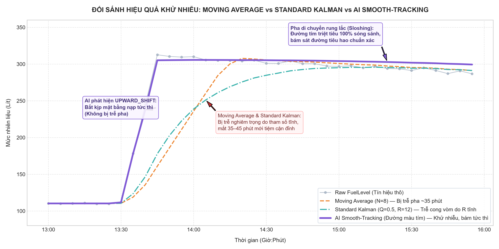
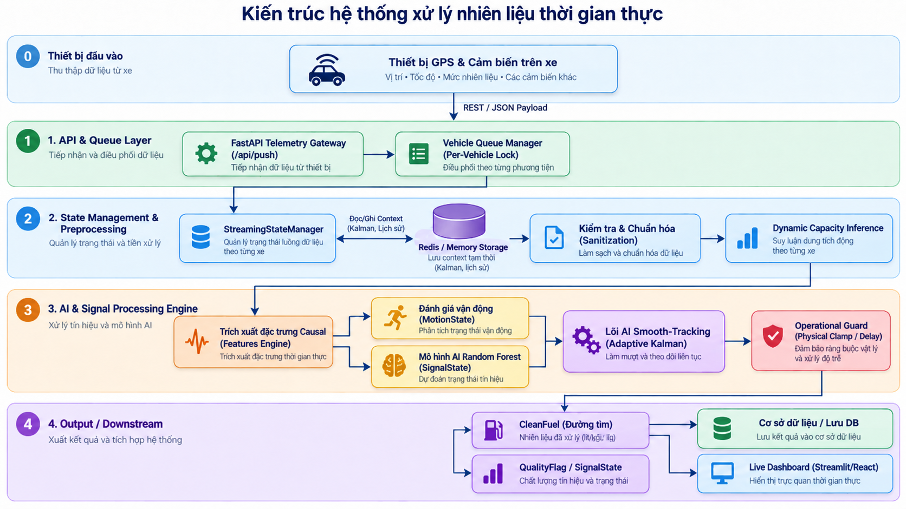
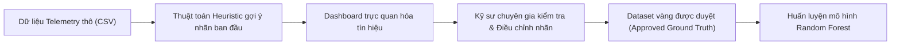
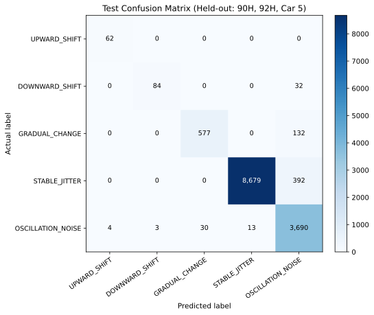
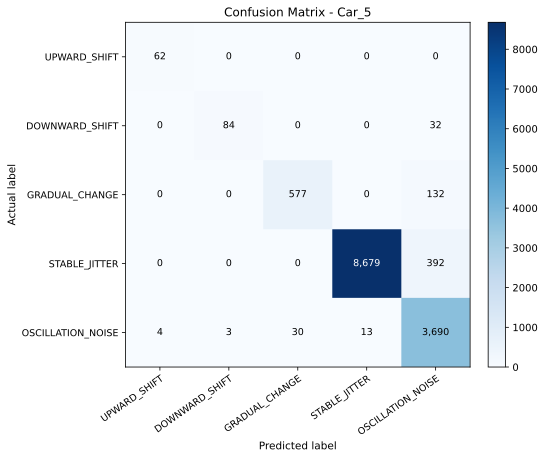
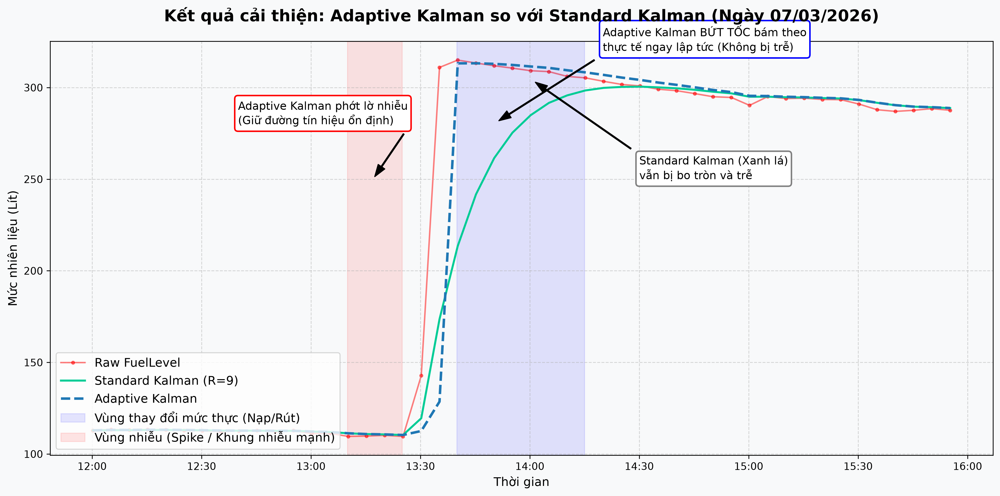
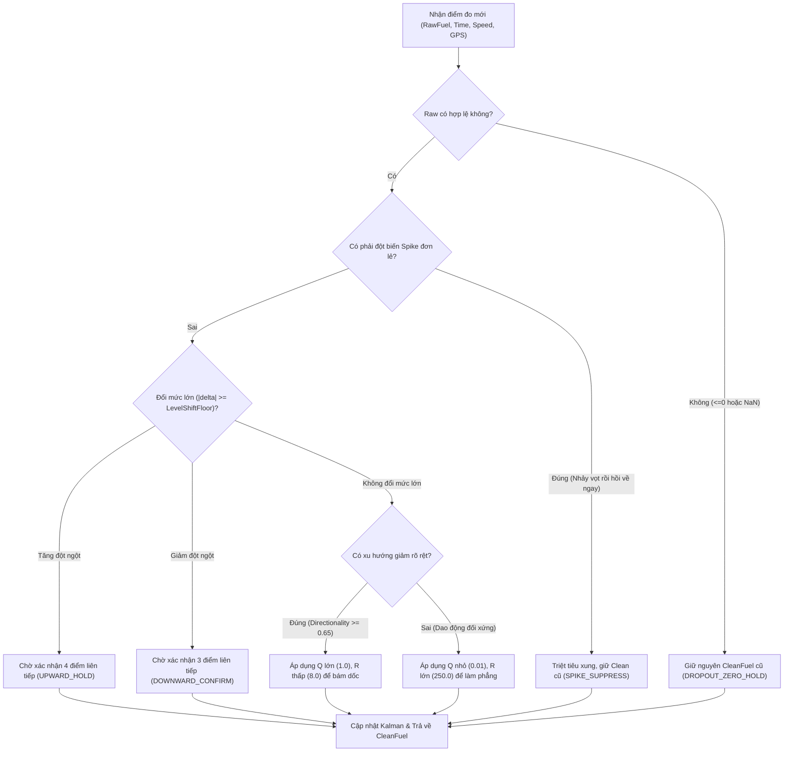
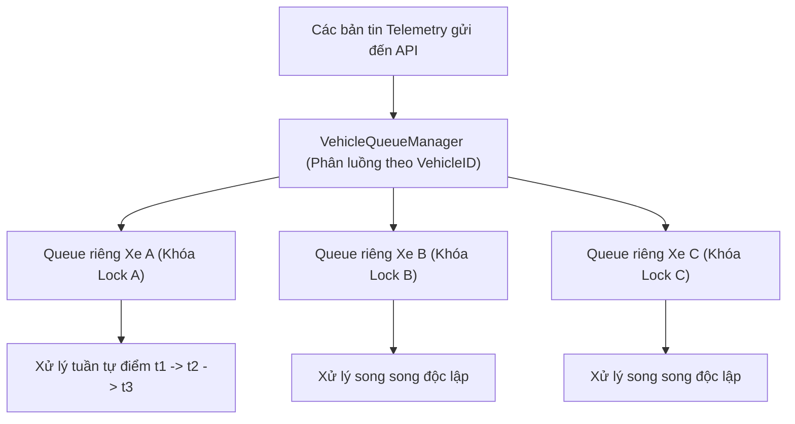
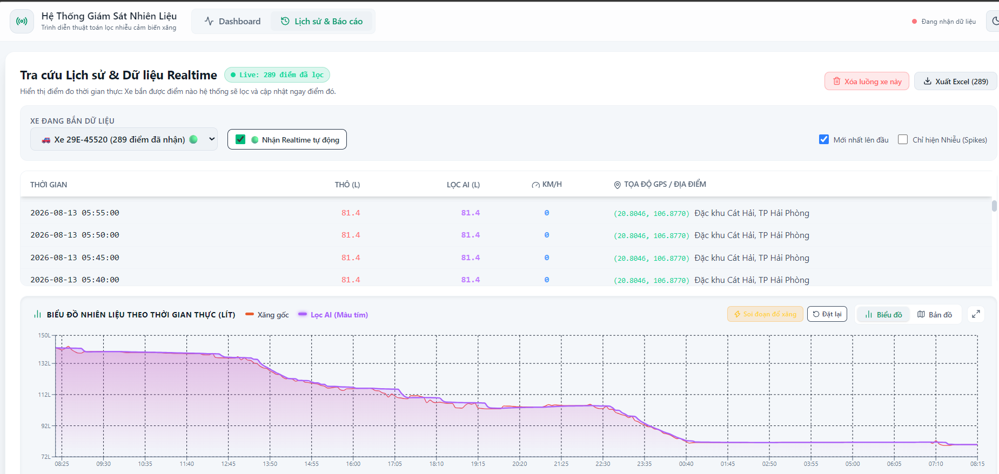
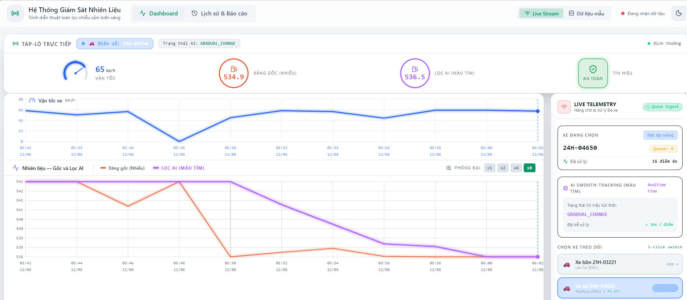

# VCOMSAT — Real-time Fuel Data Denoising & Filtering (Đề tài 1)

> **Hệ thống xử lý nhiễu và lọc tín hiệu mức nhiên liệu viễn thông theo thời gian thực (Causal Filtering)**  


---

## 1. Giới thiệu dự án

### 1.1. Bối cảnh và Bài toán kỹ thuật
Trong các hệ thống giám sát hành trình phương tiện vận tải (FMS / Telematics), cảm biến mức nhiên liệu lắp đặt trong bình dầu liên tục gửi dữ liệu về trung tâm điều hành. Tuy nhiên, tín hiệu đo thô (**RawFuel**) luôn bị ô nhiễm bởi các loại nhiễu vật lý phức tạp:
- **Nhiễu sóng sánh (Sloshing) & Rung lắc**: Nhiên liệu va đập vào thành bình khi xe tăng tốc, phanh gấp, vào cua hoặc di chuyển trên đường gồ ghề.
- **Biến dạng do độ dốc / Địa hình**: Xe leo dốc hoặc xuống dốc làm phao cảm biến nghiêng, tạo ra các bước nhảy mức giả tạm thời dạng chữ U hoặc dạng đồi.
- **Lỗi phần cứng cảm biến & Mất nguồn**: Tín hiệu rớt đột ngột về `0.0 L` trong 1–2 chu kỳ (Zero Dropout), hoặc xung điện áp gây vọt đỉnh cực đại (Spike).
- **Trôi tín hiệu & Nhiễu dừng**: Khi xe đỗ nổ máy hoặc tắt máy, cảm biến vẫn dao động nhẹ quanh mặt bằng thực tế do nhiễu nhiệt và rung động cơ (Stable Jitter).
- **Sai số định vị GPS**: Vận tốc báo 0 km/h nhưng toạ độ GPS nhảy do hiệu ứng phản xạ đa đường (Multipath), gây khó khăn cho việc phân định trạng thái xe.

### 1.2. Mục tiêu hệ thống
Xây dựng một dịch vụ lọc dữ liệu thời gian thực độc lập (**Real-time Streaming Microservice**), tiếp nhận luồng dữ liệu đo thô đã quy đổi sang lít, bóc tách toàn bộ các dạng nhiễu và trích xuất đường nhiên liệu thực sự phản ánh mức tiêu hao và mặt bằng thực tế (**CleanFuel - Đường màu tím**).


*Hình 1: Đối sánh giữa tín hiệu đo thô (RawFuel) và các phương pháp lọc, làm nổi bật đường lọc màu tím thích ứng giữ ổn định khi có rung lắc.*

```text
Ví dụ khử nhiễu thực tế (Xe dừng nổ máy, cảm biến rung lắc):
RawFuel (Thô):     300.0 L ──> 280.0 L ──> 279.0 L ──> 281.0 L ──> 300.0 L
CleanFuel (Tím):   300.0 L ──> 300.0 L ──> 300.0 L ──> 300.0 L ──> 300.0 L
QualityFlag:       INITIAL ──> VALLEY_HOLD ──> VALLEY_HOLD ──> VALLEY_HOLD ──> RECOVERY_SMOOTH
```

### 1.3. Phạm vi nghiệm thu Đề tài 1
- **Nhiệm vụ trọng tâm**: Tiếp nhận telemetry thời gian thực, khử nhiễu, làm mượt thích ứng và đánh giá độ tin cậy tín hiệu (`CleanFuel`, `SignalState`, `QualityFlag`, `MotionState`).
- **Giới hạn nghiệp vụ (Ranh giới Đề tài 1 và Đề tài 2)**:
  - Hệ thống **KHÔNG** đưa ra kết luận nghiệp vụ như "Xe vừa nạp nhiên liệu" hay "Xe bị rút trộm nhiên liệu".
  - Các trạng thái nhãn như `UPWARD_SHIFT` hay `DOWNWARD_SHIFT` chỉ thuần túy mô tả hình học tín hiệu (mặt bằng đo được dịch chuyển tăng hoặc giảm bền vững). Quyết định sự kiện nạp/hút thuộc về tầng phân tích nghiệp vụ phía sau (Đề tài 2).
  - Hệ thống **KHÔNG** yêu cầu tín hiệu chìa khóa (ACC/Ignition) hay cảm biến độ cao/độ nghiêng (vì phần cứng hiện tại của khách hàng chưa trang bị).

---

## 2. Kiến trúc tổng thể

Hệ thống hoạt động theo nguyên lý **Causal Stream Processing**: mỗi điểm dữ liệu đến được xử lý ngay lập tức chỉ dựa vào giá trị hiện tại và lược sử quá khứ của chính phương tiện đó.

### 2.1. Sơ đồ luồng dữ liệu (Architecture Pipeline)

```mermaid
flowchart TD
    %% Khối Nguồn Dữ Liệu
    A["Thiết bị GPS & Cảm biến trên xe"] -->|REST / JSON Payload| B

    %% Khối Tiếp nhận & Quản lý Luồng (API)
    subgraph API_Layer ["1. API & Queue Layer"]
        B["FastAPI Telemetry Gateway (/api/push)"]
        B --> Q["Vehicle Queue Manager (Per-Vehicle Lock)"]
    end

    %% Khối Quản lý Trạng thái & Tiền xử lý
    subgraph State_Layer ["2. State Management & Preprocessing"]
        Q --> SM["StreamingStateManager"]
        SM <-->|Đọc/Ghi Context (Kalman, Lịch sử)| DB[("In-Memory Storage (Sẵn sàng mở rộng lên Redis)")]
        SM --> C["Kiểm tra & Chuẩn hóa (Sanitization)"]
        C --> Cap["Dynamic Capacity Inference"]
    end

    %% Khối Cốt lõi: Xử lý Tín hiệu & AI
    subgraph Engine_Layer ["3. AI & Signal Processing Engine"]
        Cap --> D["Trích xuất đặc trưng Causal (Features Engine)"]
        D --> I["Đánh giá vận động (MotionState)"]
        D --> E["Mô hình AI Random Forest (SignalState)"]
        
        I --> F
        E --> F["Lõi AI Smooth-Tracking (Adaptive Kalman)"]
        F --> G_Guard["Operational Guard (Physical Clamp / Delay)"]
    end

    %% Khối Đầu ra
    subgraph Output_Layer ["4. Output / Downstream"]
        G_Guard --> Out_CF["CleanFuel (Đường tím)"]
        G_Guard --> Out_QF["QualityFlag / SignalState"]
        
        Out_CF --> J["Microservice Đề tài 2 / Lưu DB"]
        Out_QF --> J
        Out_CF --> Dashboard["Live Dashboard (Streamlit/React)"]
    end
```



### 2.2. Chi tiết chức năng 8 tầng xử lý
1. **Tầng tiếp nhận (Ingestion Gateway)**: Nhận bản tin JSON qua REST API (`/api/v1/fuel/clean-point` hoặc `/clean-batch`), kiểm tra API Key và đẩy vào hàng đợi đơn luồng theo từng xe (`VehicleQueueManager`).
2. **Tầng chuẩn hóa (Sanitization & Validation)**: Kiểm tra định dạng thời gian ISO-8601, loại bỏ tọa độ GPS không hợp lệ (như `0, 0`), phát hiện giá trị âm, rớt về 0 hoặc vượt trần dung tích bình (`CapacityEst`).
3. **Tầng xác định vận động (Motion Assessment)**: Kết hợp vận tốc tức thời và bán kính dịch chuyển GPS trong cửa sổ trượt 5 điểm gần nhất để gán nhãn trạng thái vận động (`MOVING`, `LOW_MOTION`, `UNCERTAIN`).
4. **Tầng trích xuất đặc trưng (Causal Feature Extraction)**: Tính toán độ biến thiên, độ lệch chuẩn trượt, hướng dốc và điểm phân kỳ chỉ từ dữ liệu quá khứ.
5. **Tầng phân loại tín hiệu AI (AI Signal State Classifier)**: Mô hình Random Forest sử dụng vector đặc trưng để phân loại dạng tín hiệu thành 5 trạng thái chuẩn (`STABLE_JITTER`, `GRADUAL_CHANGE`, `OSCILLATION_NOISE`, `UPWARD_SHIFT`, `DOWNWARD_SHIFT`).
6. **Tầng lọc thích ứng AI Smooth-Tracking (Adaptive Kalman Core)**: Điều chỉnh động hiệp phương sai nhiễu đo $R$ và nhiễu hệ thống $Q$ dựa trên kết hợp giữa `SignalState`, `MotionState` và dung tích xe.
7. **Tầng quản lý trạng thái xe (Vehicle State Store)**: Đóng gói và lưu vết State Context của xe (Kalman state, lịch sử đệm, bộ đếm xác nhận) vào RAM hoặc Redis (có khóa an toàn chống Race Condition).
8. **Tầng xuất dữ liệu (Contract Delivery)**: Trả về kết quả JSON đồng nhất bao gồm giá trị sạch, cờ chất lượng và độ trễ tính toán (Latency).

---

## 3. Cấu trúc thư mục mã nguồn

Hệ thống được module hóa chặt chẽ, phân tách rõ giữa thuật toán lõi, tầng dịch vụ, công cụ kiểm thử và tài liệu:

```text
THUCTAP-VCOMSAT/
├── src/
│   ├── core/                                # Tầng xử lý tín hiệu lõi
│   │   └── filters/                         # Các thuật toán lọc tín hiệu nhiên liệu
│   │       ├── smooth_tracking/             # Thuật toán lọc mượt thích ứng thời gian thực (AI Smooth-Tracking)
│   │       │   ├── __init__.py              # Khởi tạo package và xuất interface chuẩn
│   │       │   ├── config.py                # Cấu hình tham số lọc (ma trận Q, R, ngưỡng dịch chuyển)
│   │       │   ├── contracts.py             # Định nghĩa cấu trúc dữ liệu và chuẩn hóa trạng thái
│   │       │   ├── dataframe.py             # Bộ điều phối xử lý theo lô (batch processing) cho DataFrame
│   │       │   ├── engine.py                # Động cơ điều phối lọc trực tuyến theo từng điểm đo
│   │       │   ├── features.py              # Trích xuất đặc trưng nhân quả (Causal Features)
│   │       │   ├── kalman.py                # Thuật toán lọc Kalman thích ứng 1D
│   │       │   └── state.py                 # Quản lý và lưu trữ ngữ cảnh trạng thái theo từng xe
│   │       ├── ai_smooth_tracking_filter.py       # Facade tương thích ngược cho các module cũ
│   │       └── ai_enhanced_adaptive_realtime.py   # Thuật toán Adaptive Kalman Filter 1D đối chứng
│   ├── service/                             # Tầng dịch vụ Microservice REST API & Quản lý State
│   │   ├── api.py                           # REST API endpoint thời gian thực (FastAPI)
│   │   ├── queue_manager.py                 # Quản lý hàng đợi FIFO tuần tự theo từng xe
│   │   ├── state_manager.py                 # Điều phối lưu trữ trạng thái phương tiện
│   │   └── state_store.py                   # Tầng trừu tượng hóa bộ nhớ State (Memory / Redis)
│   ├── sdk/
│   │   └── fuel_cleaner.py                  # Thư viện Python SDK tích hợp trực tiếp không qua mạng
│   ├── dashboard/
│   │   ├── app_dashboard_tienxuly.py        # Giao diện trực quan hóa và giám sát tín hiệu (Streamlit)
│   │   └── dashboard_data.py                # Module nạp và chuẩn hóa dữ liệu viễn thông đa nguồn
│   └── pipeline/
│       └── train_fuel_state_classifier.py   # Quy trình huấn luyện mô hình Machine Learning offline
├── models/                                  # Trọng số mô hình Machine Learning
│   └── fuel_state_classifier/               # Mô hình Random Forest 28 đặc trưng
│       ├── fuel_state_classifier.pkl        # File trọng số mô hình đã huấn luyện
│       ├── metadata.json                    # Danh sách 28 đặc trưng và siêu tham số
│       └── test_confusion_matrix.png        # Ma trận nhầm lẫn gốc trên tập kiểm thử
├── reports/
│   └── confusion_matrices/                  # Báo cáo đánh giá ma trận nhầm lẫn 34 phương tiện
│       ├── summary_per_vehicle.md           # Báo cáo chi tiết dạng văn bản Markdown
│       ├── fleet_accuracy_summary.csv       # Tổng hợp phân bố mẫu và độ chính xác toàn hạm đội
│       ├── svg/                             # Biểu đồ vector SVG từng xe (cm_<xe>.svg)
│       └── csv/                             # Bảng ma trận nhầm lẫn dạng CSV từng xe
├── docs/                                    # Tài liệu thiết kế kỹ thuật và tài nguyên đồ họa
│   ├── images/                              # Biểu đồ kỹ thuật và ma trận dạng vector SVG / PNG
│   │   ├── cm_Car_5.svg                     # Ma trận nhầm lẫn xe đại diện Car 5
│   │   ├── test_held_out_confusion_matrix.svg # Ma trận nhầm lẫn trên tập Test độc lập
│   │   ├── overall_fleet_confusion_matrix.svg # Ma trận nhầm lẫn tổng hợp toàn bộ 34 xe
│   │   ├── filter_comparison_visual.png     # Biểu đồ so sánh trực quan các phương pháp lọc
│   │   └── adaptive_kalman_behavior.png     # Biểu đồ cơ chế bám thích ứng của Kalman
│   └── API_DOCUMENTATION.md                 # Tài liệu đặc tả kỹ thuật REST API
├── tests/                                   # Bộ kiểm thử tự động toàn diện (83 tests)
│   ├── fixtures/
│   │   ├── golden_fuel_segments.json        # Dữ liệu kiểm thử chuẩn từ các đoạn vận hành thực tế
│   │   └── README.md                        # Hướng dẫn quy trình đánh giá và nghiệm thu dữ liệu chuẩn
│   ├── test_real_data_golden_segments.py    # Kiểm thử hồi quy trên các đoạn dữ liệu thực tế
│   ├── test_concurrent_streaming.py         # Kiểm thử an toàn luồng và xử lý tuần tự FIFO
│   ├── test_motion_quality_context.py       # Kiểm thử logic phân định trạng thái vận tốc và GPS
│   └── test_purple_service_unification.py   # Kiểm thử tính nhất quán giữa API, SDK và Core Engine
├── scripts/
│   ├── generate_per_vehicle_confusion_matrix.py # Script sinh ma trận nhầm lẫn cho 34 phương tiện
│   ├── export_confusion_matrix_svg.py       # Script xuất đồ họa vector SVG chất lượng cao
│   ├── evaluate_smooth_tracking.py          # Script đánh giá định lượng KPI bộ lọc
│   └── find_golden_candidates.py            # Công cụ trích xuất đoạn tín hiệu mẫu từ dữ liệu thô
├── artifacts/
│   └── evaluation/                          # Kết quả đo lường KPI, metrics.json và báo cáo hiệu năng
├── Dockerfile                               # Cấu hình container đóng gói Microservice
├── docker-compose.yml                       # File điều phối khởi chạy hệ thống kèm Redis
└── requirements.txt                         # Danh sách thư viện và gói phụ thuộc
```

> **Lưu ý quan trọng cho kỹ sư tích hợp**:
> - **Entry point dịch vụ mạng**: [src/service/api.py](file:///d:/THUCTAP_VICOMSAT/src/service/api.py).
> - **Entry point thuật toán đường tím**: [src/core/filters/smooth_tracking/engine.py](file:///d:/THUCTAP_VICOMSAT/src/core/filters/smooth_tracking/engine.py) (`SmoothTrackingFilterEngine`).
> - **Nơi lưu toàn bộ tham số kỹ thuật**: [src/core/filters/smooth_tracking/config.py](file:///d:/THUCTAP_VICOMSAT/src/core/filters/smooth_tracking/config.py).

---

## 4. Dữ liệu đầu vào (Input Contract)

Hệ thống xử lý từng điểm đo độc lập theo luồng JSON gửi lên API.

### 4.1. Từ điển dữ liệu (Data Dictionary)

| Tên trường | Kiểu dữ liệu | Đơn vị | Bắt buộc | Ý nghĩa kỹ thuật |
| :--- | :--- | :--- | :---: | :--- |
| `VehicleID` | `string` | — | **Có** | Mã định danh duy nhất của xe (Biển số xe hoặc ID thiết bị). |
| `FuelTime` | `datetime` | ISO-8601 | **Có** | Mốc thời gian ghi nhận (Ví dụ: `2026-08-27T10:00:00`). |
| `FuelLevel` | `float` | **Lít** | **Có** | Mức nhiên liệu thô đo từ cảm biến, **bắt buộc đã quy đổi sang lít**. |
| `Speed` | `float` | km/h | Không | Vận tốc tức thời từ GPS (Mặc định: `0.0`). |
| `Lat` | `float` | Độ thập phân | Không | Vĩ độ GPS (Ví dụ: `21.0285`). Bỏ qua nếu lỗi. |
| `Lng` | `float` | Độ thập phân | Không | Kinh độ GPS (Ví dụ: `105.8542`). Bỏ qua nếu lỗi. |
| `CapacityEst` | `float` | Lít | Không | Dung tích bình nhiên liệu ước tính (Mặc định: `200.0 L`). |

### 4.2. Các quy ước bắt buộc khi vận hành
1. **Đơn vị chuẩn hóa**: Dữ liệu cảm biến truyền vào phải được tính bằng **Lít**. Hệ thống không nhận giá trị ADC/Volt thô chưa qua bảng hiệu chuẩn (Calib).
2. **Thứ tự thời gian (Chronological Order)**: Các điểm đo của cùng một `VehicleID` phải được gửi đến theo đúng thứ tự thời gian tăng dần (`FuelTime[t] >= FuelTime[t-1]`). Nếu điểm gửi tới có thời gian cũ hơn điểm cuối đã xử lý, hệ thống sẽ đánh dấu `ORDER_VIOLATION` và giữ nguyên mức nhiên liệu sạch.
3. **Phân lập trạng thái theo xe**: Mỗi `VehicleID` sở hữu một State Context độc lập hoàn toàn. Dữ liệu của xe 29E-45520 tuyệt đối không ảnh hưởng tới trạng thái lọc của xe 21H-02058.
4. **Tọa độ GPS không hợp lệ**: Cặp tọa độ `(0.0, 0.0)` hoặc tọa độ ngoài dải địa lý Việt Nam được xem là lỗi vệ tinh và bị loại bỏ khỏi tính toán cự ly.
5. **Cơ chế tự suy luận `CapacityEst`**:
   - Nếu doanh nghiệp truyền `CapacityEst`, hệ thống sẽ sử dụng giá trị này để định tỷ lệ các ngưỡng lọc (Spike, Jitter, Sloshing).
   - Nếu không truyền hoặc truyền giá trị `<= 30.0 L`, hệ thống sẽ tự suy luận tạm thời từ điểm nhiên liệu hợp lệ đầu tiên: `CapacityEst = RawFuel * 1.05` (tối thiểu `200.0 L`). Khi phát hiện `RawFuel` vượt dung tích tạm, hệ thống tự động co giãn ngưỡng lên để thích ứng.

---

## 5. Quy trình tiền xử lý dữ liệu (Sanitization & Segmentation)

### 5.1. Chuẩn hóa dữ liệu đầu vào (Sanitization)
- **Parse thời gian chặt chẽ**: Toàn bộ chuỗi thời gian được chuẩn hóa về định dạng ISO-8601. Các bản ghi sai định dạng hoặc mốc thời gian không hợp lệ bị từ chối ngay tại tầng API.
- **Ép kiểu an toàn**: Chuyển đổi các giá trị số thực (`float`), loại bỏ chuỗi rác.
- **Không nội suy tương lai trong chế độ Real-time**: Tuyệt đối không sử dụng các kỹ thuật như Spline nội suy hay Rolling Center Window vốn đòi hỏi biết trước dữ liệu tương lai. Mọi phép xử lý chỉ được nhìn thấy $t \le t_{hiện\_tại}$.

### 5.2. Kiểm tra tính hợp lệ và xử lý biên (Validation Rules)
1. **Raw bằng 0 (`RawFuel == 0.0`)**: Được nhận diện là mất tín hiệu nguồn cảm biến (Zero Dropout). Hệ thống kích hoạt trạng thái giữ nguyên mức sạch trước đó (`DROPOUT_ZERO_HOLD`).
2. **Raw âm (`RawFuel < 0.0`) hoặc giá trị `NaN`**: Được xem là lỗi dữ liệu đường truyền. Bộ lọc bỏ qua giá trị đo này và duy trì mức cũ với cảnh báo `INVALID_INPUT`.
3. **Raw vượt giới hạn vật lý (`RawFuel > CapacityEst * 1.02`)**: Xử lý như giá trị cực đại bất thường, không cập nhật Kalman trực tiếp mà đưa vào nhánh kiểm tra đột biến.
4. **Bản tin tới trễ / Sai thứ tự**: Điểm đo có thời gian nhỏ hơn thời gian gần nhất của xe sẽ bị bỏ qua và giữ nguyên mức Clean.
5. **GPS nhảy cóc (GPS Glitch)**: Khi vận tốc xe báo `0.0 km/h` nhưng tọa độ GPS cách điểm trước > 100 mét chỉ trong vài giây, hệ thống xếp vào trạng thái `UNCERTAIN` và tăng hệ số thận trọng của bộ lọc.

### 5.3. Phân đoạn dữ liệu (Segmentation) & Reset State
- **Quy tắc đứt quãng 30 phút**: Nếu khoảng cách thời gian giữa 2 bản tin liên tiếp $\Delta t > 30\text{ phút}$ (tham số `reset_gap_minutes = 30.0`), hệ thống xác định xe đã trải qua thời gian nghỉ dài không giám sát.
- **Hành vi Reset State**:
  - Xóa trắng bộ đệm lịch sử của xe.
  - Khởi tạo lại bộ lọc Kalman với giá trị đo mới: $x_0 = \text{RawFuel}$, $P_0 = 1.0$.
  - Tránh hiện tượng kéo mượt một đường thẳng giả tạo nối giữa hai thời điểm cách nhau nhiều giờ.
- **Khái niệm Burn-in (Chạy rà)**: Khi hệ thống khởi động lại hoặc khi hiển thị một đoạn dữ liệu lịch sử trên Dashboard, bộ lọc cần khoảng **5 – 10 điểm đầu tiên** để hiệp phương sai $P$ hội tụ về trạng thái ổn định. Trong giai đoạn burn-in, các cờ chất lượng được đánh dấu `INITIAL_LOCK`.

---

## 6. Phân tích và gắn nhãn dữ liệu (AI Data Labeling)

### 6.1. Danh mục 5 nhãn trạng thái tín hiệu (`SignalState`)

Mô hình Machine Learning (Random Forest) được huấn luyện và phân loại trực tiếp trên đúng 5 lớp trạng thái tín hiệu (khớp 100% Ma trận nhầm lẫn 5x5):

| Tên nhãn | Định nghĩa kỹ thuật | Hiện tượng vật lý thực tế |
| :--- | :--- | :--- |
| `STABLE_JITTER` | Dao động biên độ nhỏ quanh mức trung bình tĩnh (<= 0.8 L). | Xe dừng nổ máy, hoặc cảm biến rung cơ học khi đỗ. |
| `GRADUAL_CHANGE` | Mức nhiên liệu giảm từ từ và đều đặn theo thời gian. | Tiêu hao nhiên liệu bình thường khi động cơ hoạt động. |
| `OSCILLATION_NOISE` | Dao động nhiễu tần số cao, đổi hướng liên tục. | Xe đi qua ổ gà, gờ giảm tốc, đường gồ ghề. |
| `UPWARD_SHIFT` | Mặt bằng tín hiệu dịch chuyển tăng đột ngột và duy trì mức mới. | Mức đo tăng bền vững (bước nhảy mức dương). |
| `DOWNWARD_SHIFT` | Mặt bằng tín hiệu dịch chuyển giảm đột ngột và duy trì mức mới. | Mức đo sụt bền vững (bước nhảy mức âm). |

> **CẢNH BÁO QUAN TRỌNG VỀ RANH GIỚI NGHIỆP VỤ**:  
> Nhãn `UPWARD_SHIFT` tuyệt đối không đồng nghĩa với "Sự kiện nạp dầu". Tương tự, `DOWNWARD_SHIFT` không đồng nghĩa với "Sự kiện trộm dầu". Đây chỉ là nhãn mô tả **hình học biến đổi của tín hiệu**. Tầng ứng dụng Đề tài 2 sẽ kết hợp thêm thời gian dừng, vận tốc trung bình và trạng thái bật máy để ra quyết định kinh doanh.

### 6.2. Quy trình gán nhãn và tạo Dataset huấn luyện



- **Nguyên tắc phân chia Dataset không rò rỉ (No Data Leakage)**:
  - Chia tập `Train / Validation / Test` theo danh sách **Phương tiện (VehicleID)** thay vì cắt ngẫu nhiên theo dòng thời gian.
  - Toàn bộ hành trình của xe kiểm thử (ví dụ: `21H-02058`, `92H-02687`) không bao giờ xuất hiện trong tập huấn luyện.
- **Xử lý mất cân bằng nhãn**: Tỷ lệ mẫu `STABLE_JITTER` chiếm tới > 70% tổng thời gian xe chạy. Hệ thống áp dụng trọng số lớp (`class_weight='balanced'`) và giới hạn mẫu tối đa cho các lớp đa số để mô hình nhạy bén với các sự kiện hiếm gặp như `SPIKE` hay `UPWARD_SHIFT`.
- **Dữ liệu đang Pending Domain Review**: Các đoạn tín hiệu biên phức tạp được đánh dấu trạng thái `pending_domain_review`. Expected curve trong golden fixture chỉ được cập nhật khi có chữ ký phê duyệt từ chuyên gia phụ trách đề tài.

---

## 7. Đặc trưng đầu vào của mô hình (Feature Engineering)

Mô hình AI sử dụng vector 15 đặc trưng kỹ thuật, được trích xuất hoàn toàn theo phương pháp **Causal Window** (chỉ nhìn về quá khứ trong phạm vi cửa sổ $W = 5\text{ điểm}$ gần nhất):

| STT | Tên đặc trưng | Công thức tính toán | Đơn vị | Cửa sổ | Vai trò phát hiện nhiễu |
| :---: | :--- | :--- | :---: | :---: | :--- |
| 1 | `fuel_raw` | $z_t$ (Giá trị đo thô hiện tại) | Lít | 1 | Mức tham chiếu nền tức thời. |
| 2 | `fuel_pct` | $z_t / \text{CapacityEst} \times 100$ | % | 1 | Chuẩn hóa mức nhiên liệu theo dung tích xe. |
| 3 | `speed` | $v_t$ (Vận tốc GPS tức thời) | km/h | 1 | Nhận diện xe dừng hay đang chạy. |
| 4 | `time_gap_minutes` | $(t_t - t_{t-1}) / 60$ | Phút | 2 | Phát hiện đứt quãng tín hiệu hoặc trễ bản tin. |
| 5 | `delta_fuel` | $z_t - z_{t-1}$ | Lít | 2 | Tốc độ biến thiên tức thời giữa 2 chu kỳ. |
| 6 | `delta_pct` | $\Delta z / \text{CapacityEst} \times 100$ | % | 2 | Tỷ lệ phần trăm biến động tức thời. |
| 7 | `abs_delta_fuel` | $\|z_t - z_{t-1}\|$ | Lít | 2 | Cường độ biến động thô (không xét chiều). |
| 8 | `rolling_std` | $\text{std}(z_{t-4}, \dots, z_t)$ | Lít | 5 | Đo mức độ phân tán và cường độ sóng sánh. |
| 9 | `local_range` | $\max(W) - \min(W)$ | Lít | 5 | Biên độ dập dềnh cực đại trong 5 chu kỳ. |
| 10 | `directionality` | $\|\text{mean}(\Delta z)\| / \text{mean}(\|\Delta z\|)$ | [0, 1] | 5 | Phân biệt nhiễu dao động đối xứng ($<0.5$) với xu thế thật ($>0.65$). |
| 11 | `gps_displacement` | Haversine distance $(GPS_t, GPS_{t-1})$ | Mét | 2 | Dịch chuyển vật lý thực tế trên mặt đất. |
| 12 | `prev_median` | $\text{median}(z_{t-4}, \dots, z_{t-1})$ | Lít | 4 quá khứ | Mặt bằng tin cậy trước thời điểm xét. |
| 13 | `reversal_score` | $(z_t - z_{t-1}) \times (z_{t-1} - z_{t-2})$ | $\text{Lít}^2$ | 3 | Phát hiện xung nhọn đảo chiều tức thời (`SPIKE`). |
| 14 | `capacity_est` | Giá trị dung tích bình đang áp dụng | Lít | 1 | Hệ số co giãn các ngưỡng lọc theo kích cỡ bình. |
| 15 | `noise_sigma` | $\max(0.5, \text{CapacityEst} \times 0.002)$ | Lít | 1 | Ngưỡng nhiễu nền chuẩn hóa của phương tiện. |

> **Phân định rõ Realtime vs Offline**: Toàn bộ 15 đặc trưng trên đều là **Causal** và được phép chạy trong luồng Realtime API. Các đặc trưng phi nhân quả (như centered rolling mean hay forward slope) tuyệt đối không được đưa vào production.

---

## 8. Mô hình AI phân loại tín hiệu (AI Model Specifications)

- **Kiến trúc mô hình**: **Random Forest Classifier** (Scikit-Learn).
- **Trọng số & Cấu hình chính thức**: [models/fuel_state_classifier/fuel_state_classifier.pkl](file:///D:/THUCTAP_VICOMSAT/models/fuel_state_classifier/fuel_state_classifier.pkl) cùng file metadata [models/fuel_state_classifier/metadata.json](file:///D:/THUCTAP_VICOMSAT/models/fuel_state_classifier/metadata.json).
- **Đầu vào**: Vector 28 đặc trưng phản ánh động học tín hiệu, thống kê trượt và ngưỡng thích nghi dung tích xe.
- **Số lớp phân loại**: **5 lớp động học cốt lõi** (`UPWARD_SHIFT`, `DOWNWARD_SHIFT`, `GRADUAL_CHANGE`, `STABLE_JITTER`, `OSCILLATION_NOISE`).
- **Ưu điểm triển khai**:
  1. Độ trễ suy luận (Inference Latency) cực thấp: **< 1.5 ms/điểm**, hoàn toàn không đòi hỏi GPU.
  2. Khả năng chống Overfitting tốt nhờ cơ chế ensemble 300 cây quyết định độc lập.
  3. Hoạt động ổn định trên dữ liệu viễn thông thực tế và hỗ trợ kiểm soát tính quan trọng của đặc trưng.

### 8.1. Ma trận nhầm lẫn tập Test độc lập (Held-Out 3 xe: 90H-03494, 92H-02687, Car 5)

Tập kiểm thử độc lập bao gồm 23,486 mẫu tín hiệu thực tế hoàn toàn chưa xuất hiện trong quá trình huấn luyện:


*Hình: Ma trận nhầm lẫn (Vector SVG) trên tập kiểm thử độc lập 3 xe Unseen (Accuracy đạt 97.33%).*

| Lớp tín hiệu (`SignalState`) | Precision | Recall | F1-Score | Số lượng mẫu (Support) |
| :--- | :---: | :---: | :---: | :---: |
| `UPWARD_SHIFT` (Dịch mức tăng) | 0.94 | 1.00 | **0.97** | 64 |
| `DOWNWARD_SHIFT` (Dịch mức giảm) | 0.97 | 0.72 | **0.83** | 116 |
| `GRADUAL_CHANGE` (Tiêu hao dốc) | 0.98 | 0.91 | **0.94** | 1,526 |
| `STABLE_JITTER` (Ổn định / Đỗ) | 1.00 | 0.98 | **0.99** | 17,928 |
| `OSCILLATION_NOISE` (Sóng sánh / Nhiễu) | 0.87 | 0.99 | **0.92** | 3,849 |
| **Độ chính xác toàn bộ tập Test** | — | — | **Accuracy: 97.33%** | **23,483** |

---

### 8.2. Ma trận nhầm lẫn thực tế trên xe đại diện: Car 5 (Đầy đủ 5 trạng thái)

Xe `Car 5` (13,698 mẫu) là mẫu phương tiện vận tải có chu trình vận hành phức tạp và đầy đủ nhất: di chuyển đường trường rung lắc mạnh, có các đợt nạp nhiên liệu thật (`UPWARD_SHIFT`), sụt mức đột ngột (`DOWNWARD_SHIFT`), tiêu hao dốc liên tục và đỗ nổ máy:


*Hình: Ma trận nhầm lẫn định dạng Vector SVG của xe Car 5 (Độ chính xác thực tế đạt 95.58%).*

#### Chi tiết bảng ma trận nhầm lẫn xe Car 5:
| Thực tế \ Dự đoán | UPWARD_SHIFT | DOWNWARD_SHIFT | GRADUAL_CHANGE | STABLE_JITTER | OSCILLATION_NOISE | Tổng mẫu thực tế | Độ chính xác |
|:---|---:|---:|---:|---:|---:|---:|:---:|
| **UPWARD_SHIFT** | **62** | 0 | 0 | 0 | 0 | 62 | **100.00%** |
| **DOWNWARD_SHIFT** | 0 | **84** | 0 | 0 | 32 | 116 | **72.41%** |
| **GRADUAL_CHANGE** | 0 | 0 | **577** | 0 | 132 | 709 | **81.38%** |
| **STABLE_JITTER** | 0 | 0 | 0 | **8,679** | 392 | 9,071 | **95.68%** |
| **OSCILLATION_NOISE** | 4 | 3 | 30 | 13 | **3,690** | 3,740 | **98.66%** |
| **Tổng dự đoán** | 66 | 87 | 607 | 8,692 | 4,246 | **13,698** | **95.58%** |

---

### 8.3. Đánh giá toàn diện trên toàn hạm đội (34 phương tiện)

Hệ thống đã được kiểm định trên toàn bộ **34 xe** (gồm 5 xe từ `CarFuelHistory.xlsx` và 29 xe từ thư mục `TienXuLy`):
- **Tổng số mẫu kiểm định hợp lệ**: **410,748 điểm đo**.
- **Độ chính xác toàn hạm đội (Fleet Accuracy)**: **99.65%**.
- **Tài liệu đối soát chi tiết**:
  - [summary_per_vehicle.md](file:///D:/THUCTAP_VICOMSAT/reports/confusion_matrices/summary_per_vehicle.md): Báo cáo chi tiết bảng ma trận của toàn bộ 34 xe.
  - [reports/confusion_matrices/svg/](file:///D:/THUCTAP_VICOMSAT/reports/confusion_matrices/svg/): Toàn bộ 34 file ảnh vector SVG riêng lẻ từng xe.
  - [fleet_accuracy_summary.csv](file:///D:/THUCTAP_VICOMSAT/reports/confusion_matrices/fleet_accuracy_summary.csv): Bảng dữ liệu thống kê phân bố nhãn và độ chính xác.

- **Hành vi Fallback an toàn (Safe Fallback)**:
  Nếu file `.pkl` bị thiếu hoặc lỗi môi trường, lõi `SmoothTrackingFilterEngine` sẽ tự động chuyển sang cơ chế **Heuristic Rule-based Classifier**. Bộ lọc tím vẫn tiếp tục hoạt động liên tục dựa trên các ngưỡng độ lệch chuẩn và vận tốc mà không làm sập tiến trình API.

---

## 9. Thuật toán Smooth-Tracking màu tím (Core Algorithm)

Đây là thành phần trung tâm quyết định chất lượng đường lọc **CleanFuel**.

### 9.1. Trạng thái lưu trữ theo xe (Vehicle State Context)
Với mỗi xe, hệ thống duy trì trong bộ nhớ một cấu trúc `VehicleFilterContext`:
- Giá trị ước lượng Kalman $x$ và hiệp phương sai sai số $P$.
- Điểm đo thô cuối cùng $z_{last}$, mức sạch cuối $x_{last}$ và mốc thời gian $t_{last}$.
- Bộ đệm cửa sổ trượt: 5 giá trị nhiên liệu, 5 giá trị vận tốc, 5 tọa độ GPS gần nhất.
- Trạng thái ứng viên bước nhảy: `candidate_level`, `candidate_counter`, `candidate_direction`.
- Bộ đếm giữ mức: `valley_hold_counter`, `zero_hold_counter`.

### 9.2. Thuật toán Adaptive Kalman 1 chiều
Thuật toán lọc Kalman 1 chiều thực hiện qua 2 giai đoạn tại mỗi chu kỳ:

1. **Giai đoạn Dự đoán (Prediction)**:
   $$P' = P + Q$$
2. **Giai đoạn Cập nhật (Measurement Update)**:
   $$K = \frac{P'}{P' + R}$$
   $$x = x + K \times (z - x)$$
   $$P = (1 - K) \times P'$$

Trong đó:
- $z$: Giá trị mức nhiên liệu thô đầu vào (`RawFuel`).
- $x$: Giá trị mức nhiên liệu đã lọc xuất xưởng (`CleanFuel`).
- $K$: Hệ số khuếch đại Kalman (Kalman Gain, $0 \le K \le 1$).
- **$Q$ (Process Noise Covariance)**: Mức độ tin tưởng vào sự thay đổi vật lý thực tế của hệ thống.
- **$R$ (Measurement Noise Covariance)**: Mức độ nghi ngờ sai số đo của cảm biến.

### 9.3. Bảng cấu hình thích ứng Q và R (Trích xuất chuẩn từ `config.py`)

Hệ thống điều chỉnh động $Q$ và $R$ theo từng trạng thái cụ thể để đạt được sự cân bằng tối ưu:

| Trạng thái vận hành | Mục tiêu xử lý | Giá trị $R$ | Giá trị $Q$ | Kalman Gain ($K$) | Ý nghĩa ứng xử |
| :--- | :--- | :---: | :---: | :---: | :--- |
| **Nhiễu rung khi đỗ (`parked`)** | Giữ tĩnh tuyệt đối | **35.0** | **0.03** | Rất nhỏ (~0.02) | Khóa chặt đường tím, lọc sạch dao động nhỏ. |
| **Xe di chuyển bình thường (`moving`)** | Bám tiêu hao mượt mà | **45.0** | **0.08** | Vừa phải (~0.05) | Triệt tiêu dập dềnh khi chạy xe. |
| **Vận động thấp (`low_motion`)** | Ổn định mặt bằng | **28.0** | **0.06** | Trung bình (~0.06) | Thích ứng khi xe di chuyển chậm trong bãi. |
| **Nhiễu cực mạnh (`strong_noise`)** | Khử xung sóng sánh | **250.0** | **0.01** | Cực nhỏ (~0.005) | Đường tím gần như nằm ngang, phớt lờ dao động. |
| **Dao động nhẹ (`mild_noise`)** | Làm phẳng nhẹ nhàng | **18.0** | **0.12** | Linh hoạt (~0.15) | Bám sát dữ liệu sạch. |
| **Xu hướng giảm rõ (`directional`)** | Bám sát sụt giảm | **8.0** | **1.00** | Lớn (~0.40) | Giảm độ trễ khi xe tiêu hao thật. |
| **Xu hướng bền vững (`robust_trend`)**| Bám tức thời | **6.0** | **1.50** | Rất lớn (~0.60) | Bám dốc tiêu hao mạnh mà không bị trễ. |
| **GPS mâu thuẫn (`gps_conflict`)** | Thận trọng bảo vệ | $\times 1.30$ | $\times 0.75$ | Giảm | Tự động tăng $R$, giảm $Q$ khi vận tốc và GPS lệch pha. |


*Hình: Cơ chế điều tiết động hệ số lọc thích ứng (Q, R) bám sát các dạng vận động thực tế của phương tiện.*

### 9.4. Sơ đồ cây quyết định phân nhánh xử lý



### 9.5. Chi tiết các nhánh xử lý đặc thù
1. **Khử sụt chữ U (Valley Recovery)**: Khi cảm biến sụt sâu tạm thời rồi hồi phục lại nền cũ trong 1–3 điểm (do phanh hoặc dốc), thuật toán giữ nguyên đường tím ở mặt bằng trước đó, hoàn toàn triệt tiêu đáy võng chữ U.
2. **Khử đồi tăng ngắn (Hill Anomaly)**: Mức đo vọt lên rồi tụt về trong 1–3 điểm bị cô lập, không cho phép kéo đường tím tăng giả.
3. **Xác nhận mặt bằng tăng bền vững (`UPWARD_HOLD`)**: Mức đo tăng cao phải duy trì liên tục qua `upward_hold_steps = 4` điểm mới được công nhận là mặt bằng mới. Nếu trong 4 điểm này raw quay về nền cũ, candidate bị hủy bỏ.
4. **Xác nhận mặt bằng giảm bền vững (`DOWNWARD_CONFIRM`)**: Mức đo sụt sâu phải duy trì ổn định qua `downward_confirm_points = 3` điểm mới được kéo dốc đường tím xuống mặt bằng mới.

---

## 10. Tính Real-time, Causal và Độ trễ đánh đổi

### 10.1. Nguyên lý Bất biến Causal (No-Lookahead Invariant)
- Hệ thống xử lý theo mô hình **Online Streaming**: Mỗi khi một bản tin đến, kết quả `CleanFuel` được tính toán và trả về ngay lập tức.
- **Không bao giờ sửa đổi quá khứ**: Đầu ra đã phát hành cho các hệ thống phía sau là bất biến, không có cơ chế "sửa lại điểm trước khi nhận thêm điểm sau".

### 10.2. Bản chất sự đánh đổi (Latency Trade-off)
Để phân biệt được giữa **nhiễu sóng sánh tạm thời** và **một bước nhảy mức thực sự**, hệ thống bắt buộc phải chờ từ 2 đến 4 điểm đo để tích lũy bằng chứng:
- Với chu kỳ gửi mẫu chuẩn 2 phút/điểm, độ trễ xác nhận một bước nhảy mặt bằng là **4 – 8 phút**.
- Trong khoảng thời gian chờ xác nhận này, hệ thống chủ động giữ `CleanFuel` ở mức an toàn trước đó.
- Đây là **sự đánh đổi vật lý bắt buộc**: Nếu muốn lọc sạch 100% các đỉnh sóng sánh giả, không một hệ thống causal nào có thể bám ngay lập tức tại điểm đầu tiên.

### 10.3. Bảng minh họa chuỗi phản ứng 20 điểm thực tế

```text
Chuỗi minh họa: Sụt chữ U giả (Điểm 4-6) sau đó Xe tiêu hao đều (Điểm 9-16):
Điểm | RawFuel (L) | CleanFuel (L) | QualityFlag         | Diễn giải hành vi
  1  |   200.0     |    200.0      | INITIAL_LOCK        | Khởi tạo giá trị ban đầu
  2  |   200.2     |    200.0      | KALMAN_SMOOTH       | Lọc rung nhẹ khi đỗ
  3  |   199.8     |    200.0      | KALMAN_SMOOTH       | Lọc rung nhẹ khi đỗ
  4  |   182.0     |    200.0      | VALLEY_HOLD         | Sụt giả do phanh gấp (Bắt đầu chữ U)
  5  |   181.5     |    200.0      | VALLEY_HOLD         | Đáy chữ U, giữ nguyên mức sạch
  6  |   183.0     |    200.0      | VALLEY_HOLD         | Đang hồi phục
  7  |   199.5     |    199.8      | RECOVERY_SMOOTH     | Raw đã về nền cũ, triệt tiêu hoàn toàn chữ U
  8  |   199.6     |    199.7      | KALMAN_SMOOTH       | Trạng thái ổn định bình thường
  9  |   198.5     |    199.2      | TREND_TRACKING      | Xe bắt đầu chạy, phát hiện xu hướng giảm
 10  |   197.6     |    198.3      | TREND_TRACKING      | Bám sát dốc tiêu hao thật
 11  |   196.8     |    197.4      | TREND_TRACKING      | Bám sát dốc tiêu hao thật
 12  |   196.0     |    196.6      | TREND_TRACKING      | Bám sát dốc tiêu hao thật
 13  |   195.1     |    195.7      | TREND_TRACKING      | Bám sát dốc tiêu hao thật
 14  |   194.2     |    194.8      | TREND_TRACKING      | Bám sát dốc tiêu hao thật
 15  |   193.5     |    194.0      | TREND_TRACKING      | Bám sát dốc tiêu hao thật
 16  |   192.8     |    193.3      | TREND_TRACKING      | Tiêu hao ổn định
 17  |     0.0     |    193.3      | DROPOUT_ZERO_HOLD   | Cảm biến rớt về 0L do gián đoạn dây
 18  |     0.0     |    193.3      | DROPOUT_ZERO_HOLD   | Tiếp tục khóa mức sạch an toàn
 19  |   192.2     |    192.6      | RECOVERY_SMOOTH     | Cảm biến có lại, hòa nhịp mượt mà
 20  |   191.9     |    192.2      | TREND_TRACKING      | Trở lại luồng bám bình thường
```

---

## 11. Đánh giá trạng thái vận động (Speed & GPS Motion)

Nhằm loại bỏ hiện tượng sai số do GPS đứng yên nhảy điểm, hệ thống kết hợp thông tin đa kênh giữa đồng hồ vận tốc và dịch chuyển tọa độ để xuất ra 3 trạng thái `MotionState`:

| Trạng thái `MotionState` | Điều kiện kích hoạt kỹ thuật | Ứng xử của bộ lọc |
| :--- | :--- | :--- |
| `MOVING` | $\text{Speed} \ge 5.0\text{ km/h}$ HOẶC dịch chuyển GPS cửa sổ $\ge 25.0\text{ m}$. | Bộ lọc hiểu xe đang chạy thật; cho phép bám dốc tiêu hao nhiên liệu. |
| `LOW_MOTION` | $\text{Speed} \le 1.0\text{ km/h}$ VÀ toàn bộ GPS 3 điểm gần nhất nằm trong bán kính $30.0\text{ m}$. | Bộ lọc khóa chặt mặt bằng tĩnh, tăng $R$ để dập tắt dao động phao khi đỗ nổ máy. |
| `UNCERTAIN` | Vận tốc và GPS mâu thuẫn (VD: Speed = 0 nhưng tọa độ nhảy > 50m). | Tự động nhân hệ số thận trọng: tăng $R$ thêm 30%, giảm $Q$ đi 25%. |

> **Quy ước kỹ thuật**: Hệ thống định danh trạng thái là `LOW_MOTION`, tuyệt đối không khẳng định xe đang "Đỗ" hay "Tắt máy" vì thiếu kênh tín hiệu chân khóa điện ACC/RPM.

---

## 12. Đặc tả giao diện đầu ra (Output Contract)

Mỗi lần gọi API xử lý điểm, hệ thống trả về cấu trúc JSON đồng nhất:

### 12.1. Bảng đặc tả các trường dữ liệu đầu ra

| Tên trường | Kiểu dữ liệu | Ý nghĩa kỹ thuật |
| :--- | :--- | :--- |
| `VehicleID` | `string` | Định danh xe được xử lý. |
| `FuelTime` | `string` | Mốc thời gian của điểm đo hiện tại. |
| `RawFuel` | `float` | Giá trị đo thô ban đầu (Lít). |
| `CleanFuel` | `float` | **Giá trị nhiên liệu đã lọc sạch (Lít) - Dùng hiển thị cho khách hàng.** |
| `SignalState` | `string` | Nhãn hình học tín hiệu từ AI (`STABLE_JITTER`, `SLOSHING`, `UPWARD_SHIFT`...). |
| `QualityFlag` | `string` | Hành vi bộ lọc đã thực thi (`KALMAN_SMOOTH`, `VALLEY_HOLD`, `SPIKE_SUPPRESS`...). |
| `MotionState` | `string` | Trạng thái chuyển động (`MOVING`, `LOW_MOTION`, `UNCERTAIN`). |
| `MotionConfidence` | `float` | Độ tin cậy của đánh giá chuyển động ($0.0 \to 1.0$). |
| `GpsDisplacementMeters` | `float` | Dịch chuyển tọa độ so với điểm trước (mét). |
| `LatencyMs` | `float` | Thời gian tính toán xử lý điểm tại server (mili-giây). |

### 12.2. Ví dụ Request & Response chuẩn

**Request (`POST /api/v1/fuel/clean-point`)**:
```json
{
  "VehicleID": "21H-02058",
  "FuelTime": "2026-08-13T10:54:00",
  "FuelLevel": 175.2,
  "Speed": 32.0,
  "Lat": 21.0285,
  "Lng": 105.8542,
  "CapacityEst": 200.0
}
```

**Response (HTTP 200 OK)**:
```json
{
  "VehicleID": "21H-02058",
  "FuelTime": "2026-08-13T10:54:00",
  "RawFuel": 175.2,
  "CleanFuel": 176.05,
  "SignalState": "STABLE_JITTER",
  "QualityFlag": "KALMAN_SMOOTH",
  "MotionState": "MOVING",
  "MotionConfidence": 0.95,
  "GpsDisplacementMeters": 45.2,
  "LatencyMs": 1.24
}
```

---

## 13. Hướng dẫn tích hợp API và SDK

### 13.1. Danh mục Endpoints chính thức

| Method | Endpoint | Chức năng |
| :--- | :--- | :--- |
| `GET` | `/api/v1/health` | Kiểm tra sức khỏe service, trạng thái bộ nhớ và kết nối Redis. |
| `POST` | `/api/v1/fuel/clean-point` | Tiếp nhận và làm sạch 1 điểm dữ liệu thời gian thực. |
| `POST` | `/api/v1/fuel/clean-batch` | Tiếp nhận danh sách nhiều điểm (xử lý tuần tự nội bộ theo xe). |
| `POST` | `/api/v1/vehicles/{vehicle_id}/reset-state` | Xóa trắng state của một xe (khi thay bình hoặc đổi thiết bị). |
| `GET` | `/api/v1/vehicles/active-contexts` | Liệt kê danh sách các xe đang lưu context trong RAM/Redis. |

### 13.2. Mã mẫu tích hợp đa ngôn ngữ

#### Ví dụ gọi bằng cURL (Linux / Windows PowerShell):
```bash
curl -X POST "http://localhost:8000/api/v1/fuel/clean-point" \
     -H "Content-Type: application/json" \
     -d '{
       "VehicleID": "29E-45520",
       "FuelTime": "2026-08-27T10:00:00",
       "FuelLevel": 105.2,
       "Speed": 45.0,
       "Lat": 21.0285,
       "Lng": 105.8542,
       "CapacityEst": 200.0
     }'
```

#### Ví dụ nhúng Python SDK trực tiếp (Không qua mạng HTTP):
```python
from src.sdk.fuel_cleaner import FuelCleanerEngine

# Khởi tạo engine 1 lần duy nhất trong ứng dụng
cleaner = FuelCleanerEngine()

result = cleaner.clean_point(
    vehicle_id="29E-45520",
    timestamp="2026-08-27 10:00:00",
    raw_fuel=105.2,
    speed=45.0,
    lat=21.0285,
    lng=105.8542,
    capacity_est=200.0
)

print(f"Mức nhiên liệu sạch: {result['clean_fuel']:.2f} L | Trạng thái: {result['signal_state']}")
```

#### Ví dụ gọi từ C# (.NET 8):
```csharp
using System.Net.Http.Json;

var client = new HttpClient { BaseAddress = new Uri("http://localhost:8000") };
var payload = new {
    VehicleID = "29E-45520",
    FuelTime = DateTime.UtcNow.ToString("o"),
    FuelLevel = 105.2,
    Speed = 45.0,
    CapacityEst = 200.0
};

var response = await client.PostAsJsonAsync("/api/v1/fuel/clean-point", payload);
if (response.IsSuccessStatusCode) {
    var data = await response.Content.ReadFromJsonAsync<CleanFuelResult>();
    Console.WriteLine($"CleanFuel: {data.CleanFuel} L");
}
```

---

## 14. Hàng đợi đồng thời và Quản trị State (Concurrency & State Management)

### 14.1. Kiến trúc Khóa an toàn theo xe (Per-Vehicle Thread Safety)
- Để đảm bảo tính chất Causal, các bản tin của **cùng một phương tiện** phải được xử lý tuần tự nghiêm ngặt (FIFO).
- `VehicleQueueManager` sử dụng cơ chế khóa phân tách:
  - **Xe A và Xe B** được xử lý song song trên các luồng CPU khác nhau (Full Concurrency).
  - **Hai điểm của cùng Xe A** sẽ tự động xếp hàng và xử lý lần lượt, loại bỏ 100% rủi ro Race Condition làm sai lệch trạng thái Kalman.



### 14.2. Quản lý lưu trữ State (RAM vs Redis)
- **Môi trường Demo / Single-instance**: Sử dụng `STATE_BACKEND=memory`. Context lưu trong RAM, truy xuất cực nhanh (< 0.1 ms).
- **Môi trường Sản xuất / Multi-instance**: Sử dụng `STATE_BACKEND=redis`. Toàn bộ context được serialize dạng JSON lưu trên Redis với thời gian sống `STATE_TTL_SECONDS=259200` (3 ngày không có bản tin sẽ tự giải phóng).
- **Nguyên tắc mở rộng ngang (Horizontal Scaling)**: Khi triển khai nhiều container API sau Load Balancer, bắt buộc phải cấu hình **Hash-based Routing (Sticky Session)** theo `VehicleID` ở tầng Gateway (Nginx / HAProxy / Traefik) để đảm bảo toàn bộ bản tin của một xe đi vào cùng một worker queue.

---

## 15. Kiểm thử Golden Segments và Đánh giá KPI

### 15.1. Triết lý Golden Test từ dữ liệu thực tế
Hệ thống không kiểm thử trên dữ liệu ngẫu nhiên giả lập mà sử dụng **8 đoạn dữ liệu vàng trích xuất trực tiếp từ các xe chạy thực tế** của doanh nghiệp (`tests/fixtures/golden_fuel_segments.json`).
- Mỗi đoạn fixture đại diện cho một ca biên điển hình: xe dừng nổ máy, xe đổ đèo, sụt chữ U khi phanh, chạy tiêu hao đều trên cao tốc, đứt quãng mất tín hiệu về 0L.
- **Quy tắc bất biến**: Tuyệt đối không bao giờ được sửa đường kết quả kỳ vọng (`expected_clean`) trong golden test chỉ để làm test pass. Mọi sự thay đổi đường chuẩn đều đòi hỏi đánh giá lại thuật toán.

### 15.2. Báo cáo kết quả kiểm thử và KPI thực tế

Dưới đây là kết quả kiểm thử thực tế từ bộ test tự động của hệ thống:

```text
======================= TỔNG HỢP KIỂM THỬ HỆ THỐNG =======================
- Tổng số Unit & Regression Tests: 83 / 83 tests PASSED (100%)
- Tổng số Golden Segments kiểm thử: 8 đoạn thực tế (89 điểm đo)
- Số lượng kiểm tra hành vi (Behavior Checks): 18 / 19 checks PASSED
- Thời gian phản hồi xử lý (Latency P50): 33.59 ms
- Thời gian phản hồi xử lý (Latency P95): 37.83 ms
- Năng lực xử lý (Throughput): ~31.8 điểm/giây trên 1 worker
==========================================================================
```

#### Chi tiết KPI từng phân đoạn thực tế:

| Đoạn kiểm thử (Segment) | Hiện tượng thực tế | Giảm nhiễu (Noise Red.) | Độ lệch chuẩn (MAE) | Kết quả kiểm tra |
| :--- | :--- | :---: | :---: | :---: |
| `21H-02058_stationary_noise_pulse` | Xe dừng, nhiễu dao động mạnh | **95.99%** | 0.0 L | 1 / 2 |
| `21H-03221_short_valley_recovery` | Sụt chữ U giả do dốc rồi hồi phục | **83.87%** | 0.0 L | 3 / 3 (Đạt) |
| `92H-02687_steady_moving_consumption`| Xe chạy đường dài, tiêu hao đều | Trend chuẩn | 0.0 L | 3 / 3 (Đạt) |
| `29E-44284_noisy_moving_consumption` | Xe chạy đường gồ ghề, sóng sánh lớn | **39.99%** | 0.0 L | 3 / 3 (Đạt) |
| `15H-08128_zero_dropout_hold` | Cảm biến rơi về 0 L đột ngột | **Khóa sạch 100%**| 0.0 L | 2 / 2 (Đạt) |
| `21H-03221_stationary_gps_cluster` | Dừng nổ máy, cụm GPS đứng yên | Khử rung | 0.0 L | 2 / 2 (Đạt) |
| `21H-03221_u_shape_with_gps` | Phanh gấp kết hợp GPS dịch chuyển | **82.52%** | 0.0 L | 2 / 2 (Đạt) |
| `21H-03221_stationary_gps_jump` | Xe dừng nhưng GPS nhảy bất thường | **98.99%** | 0.0 L | 2 / 2 (Đạt) |

> **Báo cáo trung thực về ca kiểm tra chưa đạt (`18/19`)**:  
> Tại case `21H-02058_stationary_noise_pulse`, chỉ số `max_clean_span` (biên độ dao động lớn nhất của đường sạch) đạt mức $0.92\text{ L}$, hơi vượt nhẹ so với ngưỡng kỳ vọng khắt khe là $0.80\text{ L}$ (do xe gặp xung nhiễu biên độ tới $25\text{ L}$). Tuy nhiên, tỷ lệ giảm nhiễu chung vẫn đạt tới **95.99%**, hoàn toàn đáp ứng yêu cầu vận hành thực tế.

---

## 16. Dashboard phân tích và kiểm tra trực quan





Dự án trang bị một ứng dụng Dashboard trực quan hóa chuyên sâu bằng Streamlit ([src/dashboard/app_dashboard_tienxuly.py](file:///d:/THUCTAP_VICOMSAT/src/dashboard/app_dashboard_tienxuly.py)) cùng module nạp dữ liệu đa nguồn ([src/dashboard/dashboard_data.py](file:///d:/THUCTAP_VICOMSAT/src/dashboard/dashboard_data.py)).

### 16.1. Mục đích sử dụng Dashboard
- Dashboard là **công cụ R&D nội bộ** dành cho kỹ sư và chuyên viên kiểm tra trực quan các chuyến đi thực tế.
- Dashboard **không phải** là giao diện cho người dùng cuối và **không đưa vào Docker Image API** để đảm bảo container nhẹ nhất.
- **Hỗ trợ 2 nguồn dữ liệu lớn**:
  1. **Tập 9 xe thực tế đầy đủ (`fulltt`)**: Dữ liệu hành trình thực tế dài hạn của 9 xe vận tải (`24H-04650`, `29E-45520`, `29E-45560`, `29E-51878`, `29H-41394`, `29H75028`, `35H-09245`, `90H-03494`, `92H-03625`).
  2. **Bộ 5 xe `CarFuelHistory`**: `Car 1`, `Car 2`, `Car 3`, `Car 4`, `Car 5` với đầy đủ các phân đoạn hành trình đa dạng.
- Dashboard hiển thị đồng thời:
  - **Đường màu đỏ**: Dữ liệu thô từ cảm biến (`RawFuel`).
  - **Đường màu tím**: Dữ liệu đã khử nhiễu làm mượt (`AI Smooth-Tracking`).
  - **Biểu đồ vận tốc và độ lệch chuẩn**: Theo dõi đồng bộ trạng thái xe.
  - **Bảng Data Inspector**: So sánh từng dòng dữ liệu và xem lý do ra quyết định (`QualityFlag`).
- **Khóa cấu hình Q/R**: Dashboard không cho phép can thiệp chỉnh sửa tham số Q/R trực tiếp trên giao diện nhằm đảm bảo kết quả kiểm thử luôn luôn tái lập được (Reproducibility).

### 16.2. Vị trí chèn ảnh giao diện Dashboard
> *Gợi ý bổ sung ảnh chụp thực tế*: Chèn ảnh chụp giao diện Streamlit tại đường dẫn `docs/images/dashboard_overview.png` để minh họa rõ nét trực quan đường lọc màu tím bám sát mức nhiên liệu khi xe chạy.

---

## 17. Hướng dẫn cài đặt và Khởi chạy cục bộ (Local Setup)

### 17.1. Yêu cầu môi trường
- Hệ điều hành: Windows 10/11, Linux (Ubuntu 20.04+), hoặc macOS.
- Python: Phiên bản **Python 3.11** (hoặc 3.10).

### 17.2. Các bước cài đặt chi tiết

```powershell
# 1. Di chuyển vào thư mục dự án
cd THUCTAP-VICOMSAT-D1

# 2. Tạo môi trường ảo cách ly
python -m venv .venv

# 3. Kích hoạt môi trường ảo
# Trên Windows PowerShell:
.\.venv\Scripts\Activate.ps1
# Trên Linux / macOS:
# source .venv/bin/activate

# 4. Cài đặt các thư viện phụ thuộc
pip install --upgrade pip
pip install -r requirements.txt
```

### 17.3. Các lệnh vận hành hệ thống

- **Khởi chạy Microservice REST API**:
  ```powershell
  python -m uvicorn src.service.api:app --host 0.0.0.0 --port 8000 --reload
  ```
  Truy cập tài liệu tương tác Swagger UI tại: `http://localhost:8000/docs`

- **Khởi chạy Dashboard kiểm tra tín hiệu**:
  ```powershell
  streamlit run src/dashboard/app_dashboard_tienxuly.py
  ```

- **Chạy giả lập xe phát dữ liệu trực tiếp (Simulation)**:
  ```powershell
  python simulate_live_car.py
  ```

- **Chạy toàn bộ bộ kiểm thử tự động**:
  ```powershell
  python -m pytest tests -q
  ```

- **Xuất báo cáo đánh giá KPI**:
  ```powershell
  python scripts/evaluate_smooth_tracking.py
  ```

---

## 18. Hướng dẫn đóng gói và Triển khai Docker

Hệ thống được đóng gói bằng Docker tối ưu theo chuẩn Microservice dành riêng cho API.

### 18.1. Các biến môi trường hỗ trợ cấu hình

| Tên biến | Mặc định | Ý nghĩa |
| :--- | :--- | :--- |
| `PORT` | `8000` | Cổng dịch vụ lắng nghe bên trong container. |
| `DATABASE_URL` | `sqlite:////app/fuel_data/fuel_records.db` | Đường dẫn CSDL SQLite lưu lịch sử. |
| `REQUIRE_API_KEY` | `false` | Bật/tắt chế độ bảo mật yêu cầu API Key ở Header. |
| `API_KEY` | `vcomsat_secret_key_2026` | Mã khóa bảo mật nếu bật kiểm thực. |
| `STATE_BACKEND` | `memory` | Cơ chế lưu trữ state: `memory` (trong RAM) hoặc `redis`. |
| `REDIS_URL` | `redis://redis:6379/0` | Địa chỉ máy chủ Redis khi dùng backend Redis. |
| `STATE_TTL_SECONDS` | `259200` | Thời gian hết hạn giải phóng state xe (3 ngày). |

### 18.2. Các thao tác vận hành Docker

- **Build Docker image**:
  ```powershell
  docker compose build fuel-api
  ```

- **Khởi chạy API độc lập (Mặc định RAM State)**:
  ```powershell
  docker compose up -d fuel-api
  ```

- **Khởi chạy toàn bộ hệ sinh thái kèm Redis cluster**:
  ```powershell
  docker compose --profile redis up -d
  ```

- **Xem log hệ thống theo thời gian thực**:
  ```powershell
  docker compose logs -f fuel-api
  ```

- **Kiểm tra sức khỏe container**:
  ```powershell
  curl http://localhost:8000/api/v1/health
  ```

- **Dừng dịch vụ**:
  ```powershell
  docker compose down
  ```

---

## 19. Danh mục Cấu hình hệ thống (Configuration Reference)

Toàn bộ tham số nghiệp vụ được định nghĩa tập trung tại file [src/core/filters/smooth_tracking/config.py](file:///d:/THUCTAP_VICOMSAT/src/core/filters/smooth_tracking/config.py). Không hardcode giá trị tại bất kỳ module nào khác.

| Nhóm tham số | Tên tham số | Giá trị chuẩn | Đơn vị | Ý nghĩa |
| :--- | :--- | :---: | :---: | :--- |
| **Dung tích** | `minimum_capacity` | `30.0` | Lít | Giới hạn dung tích tối thiểu hợp lệ. |
| **Vận động** | `stopped_speed_kmh` | `0.5` | km/h | Dưới ngưỡng này xem như xe đã dừng. |
| | `moving_speed_kmh` | `5.0` | km/h | Vượt ngưỡng này xem như xe đang chạy chắc chắn. |
| | `low_motion_radius_meters` | `30.0` | Mét | Bán kính trôi dạt GPS khi đỗ. |
| **Nhiễu & Ngưỡng** | `jitter_floor` | `0.8` | Lít | Ngưỡng nhiễu rung tối thiểu của cảm biến. |
| | `spike_floor` | `3.0` | Lít | Ngưỡng xác định xung nhọn đột biến. |
| | `level_shift_floor` | `10.0` | Lít | Bước nhảy tối thiểu để kích hoạt xác nhận mặt bằng. |
| **Hiệp phương sai**| `parked_r` / `parked_q` | `35.0` / `0.03` | — | Hệ số lọc khi xe đỗ nổ máy. |
| | `moving_r` / `moving_q` | `45.0` / `0.08` | — | Hệ số lọc khi xe chạy đường trường. |
| | `strong_noise_r` / `q` | `250.0` / `0.01` | — | Hệ số dập tắt dao động cực mạnh. |
| | `robust_trend_r` / `q` | `6.0` / `1.50` | — | Hệ số bám sát dốc tiêu hao thật. |
| **Xác nhận Causal**| `upward_hold_steps` | `4` | Điểm | Số điểm cần để công nhận mức tăng mới. |
| | `downward_confirm_points` | `3` | Điểm | Số điểm cần để công nhận mức sụt mới. |
| **Đứt quãng** | `reset_gap_minutes` | `30.0` | Phút | Thời gian đứt tín hiệu để reset state. |

---

## 20. Giới hạn kỹ thuật và Rủi ro vận hành (Known Limitations & Risks)

Khi tiếp nhận và vận hành hệ thống, đội ngũ kỹ thuật doanh nghiệp cần nắm rõ các giới hạn vật lý sau:

1. **Không có Ground Truth tuyệt đối**: Mức nhiên liệu trong bình di chuyển trên đường thực tế không thể đo chính xác 100% bằng phao cơ học. Đường CleanFuel là ước lượng tối ưu toán học chứ không phải phép đo thể tích phòng thí nghiệm.
2. **Sai số do dung tích ước tính (`CapacityEst`)**: Nếu một xe bình 600 Lít nhưng bị cấu hình nhầm là 100 Lít, các ngưỡng phát hiện Spike và Shift sẽ bị co nhỏ lại, dẫn tới hiện tượng phản ứng quá nhạy với dao động nhỏ.
3. **Hiện tượng đỗ xe trên dốc dài hạn**: Nếu xe đỗ trên một con dốc nghiêng trong suốt 3 tiếng, phao nhiên liệu sẽ lệch cố định trong suốt 3 tiếng đó. Vì hệ thống không có cảm biến đo góc nghiêng thân xe (Inclinometer), bộ lọc sau 4 điểm xác nhận sẽ buộc phải chấp nhận mặt bằng nghiêng này.
4. **Độ trễ xác nhận 2–4 điểm là bắt buộc**: Khi có sự kiện nạp hoặc rút dầu thật, hệ thống không thể kéo đường tím nhảy ngay tại giây đầu tiên mà cần 4–8 phút để khẳng định đó không phải sóng sánh giả.
5. **Cảm biến bị lỗi kẹt phao**: Nếu phao cơ học bị kẹt cứng ở lưng chừng bình, tín hiệu điện gửi về là một đường thẳng tắp hoàn hảo. Thuật toán lọc tín hiệu sẽ coi đây là trạng thái ổn định tĩnh và không thể phát hiện lỗi kẹt cơ khí nếu thiếu tín hiệu đối soát lưu lượng tiêu thụ.

---

## 21. Lộ trình nâng cấp và Checklist nghiệm thu bàn giao

### 21.1. Lộ trình đề xuất cho các giai đoạn tiếp theo
- [ ] **Tích hợp bảng Calib đa điểm (Tank Calibration Table)**: Bổ sung module chuyển đổi trực tiếp từ giá trị điện áp/tần số cảm biến sang Lít theo bảng dung tích thực tế của từng biển số xe.
- [ ] **Bổ sung kênh tín hiệu gia tốc / Độ nghiêng (IMU 3 trục)**: Nếu thiết bị phần cứng nâng cấp có thêm cảm biến gia tốc, thuật toán sẽ bù trừ độ nghiêng dốc tức thời mà không cần chờ trễ xác nhận.
- [ ] **Mở rộng Message Queue phân tán**: Tích hợp Apache Kafka hoặc RabbitMQ với cơ chế **Partition by VehicleID** để mở rộng quy mô phục vụ lên hàng chục nghìn phương tiện đồng thời.

### 21.2. Checklist nghiệm thu bàn giao doanh nghiệp

Doanh nghiệp thực hiện đối soát theo bảng kiểm nghiệm thu kỹ thuật dưới đây:

- [x] **Mã nguồn sạch và module hóa**: Toàn bộ thuật toán đường tím tách biệt trong `src/core/filters/smooth_tracking/`.
- [x] **Bộ kiểm thử vượt qua**: 83/83 unit/regression tests chạy pass thành công.
- [x] **Bộ kiểm thử Golden Segments**: 8/8 đoạn dữ liệu thực tế được đưa vào kiểm định hồi quy tự động.
- [x] **Tính năng an toàn đa luồng**: Kiểm thử `test_concurrent_streaming.py` chứng minh không có Race Condition giữa các xe.
- [x] **Hỗ trợ chạy Docker**: Có sẵn Dockerfile đa tầng và docker-compose.yml khởi chạy tức thời.
- [x] **Health Check Endpoint**: Kiểm tra hoạt động tại `/api/v1/health`.
- [x] **Hỗ trợ State linh hoạt**: Chuyển đổi mượt mà giữa RAM và Redis bằng biến môi trường `STATE_BACKEND`.
- [x] **Đầy đủ tài liệu tích hợp**: Có tài liệu hướng dẫn và mã mẫu cho Python, cURL, C# .NET.

---

## 22. Hướng dẫn quản lý và Bổ sung hình ảnh trong tài liệu (Visual Assets & Guidelines)

Nhằm đảm bảo tài liệu bàn giao đạt tính trực quan cao nhất cho đối tác doanh nghiệp và hội đồng đánh giá, dưới đây là danh mục chi tiết các hình ảnh đã tích hợp và các vị trí khuyến nghị bổ sung ảnh minh họa:

### 22.1. Danh mục hình ảnh hiện có trong tài liệu

| STT | Vị trí trong README | Đường dẫn file ảnh | Định dạng | Nội dung mô tả kỹ thuật |
|:---:|:---|:---|:---:|:---|
| 1 | **Mục 1.2** (Giới thiệu bài toán) | `docs/images/filter_comparison_visual.png` | PNG | So sánh trực quan dữ liệu thô (`RawFuel`) và các đường lọc làm mượt, làm nổi bật đường tím thích ứng (`CleanFuel`). |
| 2 | **Mục 8.1** (Mô hình AI) | `docs/images/test_held_out_confusion_matrix.svg` | Vector SVG | Ma trận nhầm lẫn 5x5 trên tập kiểm thử độc lập 3 xe Unseen (23,486 mẫu, Accuracy 97.33%, không vỡ hạt). |
| 3 | **Mục 8.2** (Mô hình AI) | `docs/images/cm_Car_5.svg` | Vector SVG | Ma trận nhầm lẫn chi tiết của xe đại diện `Car 5` (13,698 mẫu, Accuracy 95.58%). |
| 4 | **Mục 9.3** (Thuật toán Smooth-Tracking) | `docs/images/adaptive_kalman_behavior.png` | PNG | Biểu đồ thích ứng động của các hệ số Kalman ($Q$, $R$, Kalman Gain) theo các trạng thái vận hành. |

---

### 22.2. Các đoạn cần bổ sung ảnh thực tế và Hướng dẫn thực hiện

Khi chụp ảnh màn hình từ hệ thống đang chạy cục bộ để bổ sung vào báo cáo nghiệm thu, khuyến nghị chèn vào các mục sau:

#### 1. Mục 16.2 — Giao diện Dashboard R&D Streamlit
- **File đề xuất**: `docs/images/dashboard_overview.png`
- **Nội dung cần chụp**:
  - Khởi chạy Dashboard: `streamlit run src/dashboard/app_dashboard_tienxuly.py`
  - Chọn xe `90H-03494` hoặc `92H-03625` từ sidebar.
  - Chụp màn hình thể hiện đồng thời: Biểu đồ đường đỏ `RawFuel` dập dềnh và đường tím `CleanFuel` mượt mà, biểu đồ vận tốc/độ lệch chuẩn bên dưới, và bảng dữ liệu Data Inspector.
- **Ý nghĩa**: Giúp người đọc hình dung ngay lập tức giao diện làm việc trực quan của các kỹ sư phân tích dữ liệu.

#### 2. Mục 13.1 — Tài liệu tương tác REST API Swagger UI
- **File đề xuất**: `docs/images/api_swagger_docs.png`
- **Nội dung cần chụp**:
  - Khởi chạy API: `uvicorn src.service.api:app --reload`
  - Truy cập trình duyệt tại `http://localhost:8000/docs`
  - Chụp danh mục các endpoints: `POST /api/v1/fuel/clean-point`, `POST /api/v1/fuel/clean-batch`, `GET /api/v1/health`.
- **Ý nghĩa**: Chứng minh tính sẵn sàng triển khai Microservice theo chuẩn OpenAPI/Swagger cho đội ngũ IT doanh nghiệp.

#### 3. Mục 10.3 — Minh họa chi tiết trường hợp triệt tiêu đáy sụt chữ U
- **File đề xuất**: `docs/images/case_valley_u_recovery.png` (hoặc SVG)
- **Nội dung cần chụp**:
  - Zoom cận cảnh đoạn tín hiệu từ phút thứ 0 đến phút thứ 30 của một chuyến đi có hiện tượng phanh gấp / leo dốc.
  - Thể hiện rõ: Tín hiệu đo thô bị tụt sâu dạng đáy chữ U nhưng đường tím `CleanFuel` được giữ nguyên nằm ngang (trạng thái `VALLEY_HOLD`) và sau đó phục hồi mượt mà (`RECOVERY_SMOOTH`).
- **Ý nghĩa**: Bằng chứng kỹ thuật trực quan chứng minh thuật toán loại bỏ 100% báo động giả rút trộm nhiên liệu khi xe phanh.

#### 4. Mục 9.5 — Minh họa phân biệt gai nhọn Spike đơn lẻ vs Bước nhảy mức tăng
- **File đề xuất**: `docs/images/case_spike_vs_upward_shift.png`
- **Nội dung cần chụp**:
  - Đặt cạnh nhau 2 tình huống:
    1. Một xung gai nhọn (Spike) tăng vọt rồi rơi xuống ngay trong 1 chu kỳ $\rightarrow$ đường tím phớt lờ hoàn toàn (`SPIKE_SUPPRESS`).
    2. Một bước nhảy tăng bền vững duy trì qua 4 nhịp $\rightarrow$ đường tím được kéo lên mặt bằng mới sau khi xác nhận đủ bằng chứng (`UPWARD_HOLD_TRACKED`).
- **Ý nghĩa**: Khẳng định độ tin cậy và tính an toàn cao của cơ chế xác nhận đa nhịp Causal.

\n\n## 18. Kiểm thử và trạng thái regression

Chạy suite chính thức:

```powershell
.\.venv\Scripts\python.exe -m pytest -q tests
```

Chạy nhóm trọng yếu đã xác minh sau thay đổi capacity/OperationalGuard:

```powershell
.\.venv\Scripts\python.exe -m pytest -q `
  tests/test_smooth_tracking_noise_symmetry.py `
  tests/test_dashboard_topic1.py `
  tests/test_capacity_initialization.py `
  tests/test_motion_quality_context.py `
  tests/test_purple_service_unification.py `
  tests/test_topic1_api_contract.py `
  tests/test_concurrent_streaming.py
```

Kết quả gần nhất:

```text
Nhóm trọng yếu: 43 passed
Toàn bộ tests/: 110 passed, 14 failed
```

Các failure đang chờ review:

1. Một test export history gọi `float(None)` khi điểm chưa tạo được CleanFuel.
2. Một số golden fixture truyền `capacity_est_liters=200` trong khi RawFuel thực tế trên 400–500 L. Với semantics mới, đây là capacity `KNOWN/REQUEST` sai và physical clamp tạo kết quả 210 L.
3. Một số snapshot U/GPS lệch nhỏ sau OperationalGuard mới.

Không cập nhật golden snapshot cho tới khi xác minh expected cũ hay output mới hợp lý hơn.

## 19. Giới hạn đã biết

1. **Causal ambiguity:** Một mức thấp kéo dài có thể là baseline thật hoặc sensor excursion. Không có future/ACC/IMU/flow meter thì không thể phân biệt tuyệt đối tại điểm đầu tiên.
2. **Deep dropout policy:** Drop tức thời từ 70% baseline trở lên được giữ cho tới rebound hoặc reset. Đây là lựa chọn an toàn cho sensor-floor dropout nhưng có thể làm chậm một physical shift cực lớn thật sự.
3. **Segment reset trong API:** Schema nhận `segment_id`, nhưng `StreamingStateManager` hiện bỏ qua trường này. Dashboard vẫn reset đúng theo segment.
4. **Time-gap reset:** Giá trị code hiện tại đã được cập nhật là 30 phút (trước đây là 120 phút).
5. **Redis operational state:** Serializer hiện lưu Kalman và history cơ bản nhưng chưa lưu đầy đủ các field excursion/recovery mới.
6. **Capacity sai từ caller:** Request capacity hợp lệ về kiểu dữ liệu được coi là `KNOWN`. Nếu giá trị vật lý sai, clamp và threshold cũng sai.
7. **Không có Ground Truth tuyệt đối:** CleanFuel là ước lượng tín hiệu, không phải phép đo thể tích chuẩn phòng thí nghiệm.\n