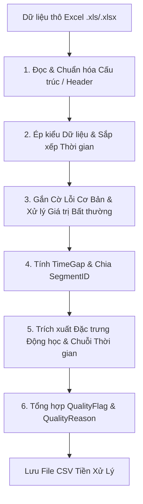
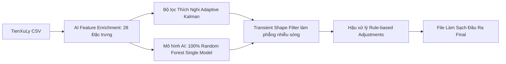
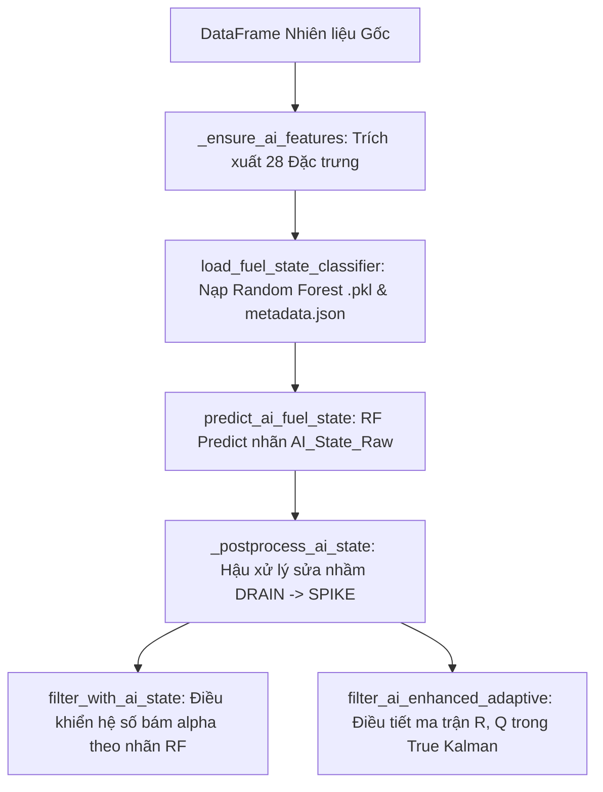

# BÁO CÁO TỔNG QUAN HỆ THỐNG TIỀN XỬ LÝ, BỘ LỌC VÀ AI LÀM SẠCH DỮ LIỆU NHIÊN LIỆU XE (VICOMSAT)

---

## I. TỔNG QUAN DỰ ÁN VÀ THÀNH PHẦN TIỀN XỬ LÝ

### 1. Overview Dự án
Hệ thống xử lý và phân tích dữ liệu nhiên liệu xe thông minh cho **VICOMSAT** nhằm mục đích làm sạch dữ liệu cảm biến nhiên liệu thực tế từ các xe tải/xe khách. Dữ liệu gốc thường bị ảnh hưởng nghiêm trọng bởi các loại nhiễu vật lý (sóng sánh nhiên liệu khi xe phanh/rẽ, mất tín hiệu GPS/GPRS, lỗi cảm biến về 0, sụt áp nguồn).

Hệ thống kết hợp 3 lớp xử lý chính:
1. **Tiền xử lý thô (Data Preprocessing)**.
2. **Bộ lọc thích nghi & Xử lý hình thái sóng (Adaptive Kalman & Transient Shape Clean)**.
3. **Mô hình AI Phân loại Trạng thái Nhiên liệu (100% Random Forest Single Model)**.

---

### 2. Các Module Đảm Nhận Tiền Xử Lý (Preprocessing)
Các file mã nguồn chịu trách nhiệm thực hiện tiền xử lý dữ liệu đầu vào bao gồm:

*   [`preprocess_dulieu.py`](file:///d:/THUCTAP_VICOMSAT/src/pipeline/preprocess_dulieu.py): Đọc và xử lý toàn bộ các file Excel báo cáo lịch sử nhiên liệu thô từ thư mục `dulieu/`.
*   [`preprocess_fulltt.py`](file:///d:/THUCTAP_VICOMSAT/src/pipeline/preprocess_fulltt.py): Xử lý dữ liệu đã gộp từ thư mục `fulltt/` (`*_da_gop.xlsx`).
*   [`preprocess_pipeline.py`](file:///d:/THUCTAP_VICOMSAT/src/pipeline/preprocess_pipeline.py): Pipeline tiền xử lý tích hợp chuẩn hóa dòng dữ liệu.
*   [`app_dashboard_tienxuly.py`](file:///d:/THUCTAP_VICOMSAT/src/dashboard/app_dashboard_tienxuly.py): Dashboard tương tác (Streamlit UI) giúp hiển thị, cấu hình và trực quan hóa quy trình tiền xử lý 26 xe.

---

## II. CHI TIẾT CÁC BƯỚC TIỀN XỬ LÝ (PREPROCESSING STEPS)

Khi dữ liệu thô (Excel `.xls` / `.xlsx`) được đưa vào module tiền xử lý, hệ thống thực hiện 6 bước chính sau:

### Bước 1: Đọc & Chuẩn hóa Cấu trúc Cột
*   Đọc các sheet dữ liệu từ file Excel (header bắt đầu từ dòng 13 hoặc dòng 1).
*   Đổi tên cột từ tiếng Việt chuẩn sang các trường tên thống nhất:
    *   `Thời gian` $\rightarrow$ `FuelTime`
    *   `Nhiên liệu` $\rightarrow$ `FuelLevel`
    *   `Vận tốc` $\rightarrow$ `Speed`
    *   `Địa điểm` $\rightarrow$ `Address`
*   Trích xuất/gán `VehicleID` (Biển số xe).

### Bước 2: Ép kiểu Dữ liệu & Sắp xếp Thời gian
*   Chuyển `FuelTime` về định dạng `datetime` (`YYYY-MM-DD HH:MM:SS`).
*   Ép kiểu dữ liệu số (`float`) cho `FuelLevel`, `Speed`, `Lat`, `Lng`.
*   Loại bỏ các dòng có `FuelTime` bị thiếu (NaN).
*   Sắp xếp toàn bộ dữ liệu tăng dần theo thời gian (`FuelTime`).

### Bước 3: Gắn cờ Lỗi Cơ Bản & Xử lý Giá trị Bất hợp lý
*   **`FlagFuelZero`**: Đánh dấu 1 nếu `FuelLevel == 0` (lỗi mất tín hiệu cảm biến sụt về 0).
*   **`FlagDuplicateTime`**: Đánh dấu 1 nếu trùng mốc thời gian.
*   **`FuelLevel_calc`**: Đặt giá trị nhiên liệu bị lỗi (`FuelLevel == 0`) thành `NaN` trong bản sao tính toán để không làm làm lệch các thống kê trượt (rolling).

### Bước 4: Tính Khoảng thời gian (TimeGap) & Phân đoạn Hành trình (SegmentID)
*   **`TimeGapMinutes`**: Tính khoảng thời gian lệch (tính bằng phút) giữa 2 mốc ghi nhận liên tiếp.
*   **Phân đoạn SegmentID**:
    *   Nếu `TimeGapMinutes >= 120` phút (xe tắt máy nghỉ dài) hoặc mốc đầu tiên $\rightarrow$ Tách sang **SegmentID** mới (`IsSegmentStart = 1`).
*   **Phân biệt Dừng xe thực sự vs. Mất tín hiệu khi di chuyển**:
    *   Tính khoảng cách GPS di chuyển bằng công thức Haversine (`DistanceMeters`).
    *   Xác định ngưỡng khoảng nghỉ động:
        $$\text{DynamicGapThreshold} = \max(\text{RollingMedian}(\text{TimeGapMinutes}, 20) \times 3, 5.0)$$
    *   Nếu thời gian gián đoạn lớn nhưng xe dừng hẳn (`Speed <= 5 km/h`, `Distance <= 50m`) $\rightarrow$ Xác nhận đỗ xe an toàn.
    *   Nếu mất tín hiệu khi xe vẫn đang di chuyển $\rightarrow$ Gắn cờ **`FlagSuspiciousGap`** (`SIGNAL_LOSS_MOVING`).

### Bước 5: Trích xuất Đặc trưng Chuỗi Thời gian & Động học
*   **`DeltaFuel`**: Mức chênh lệch nhiên liệu giữa điểm hiện tại và điểm liền trước trong cùng Segment.
*   **`FuelRate`**: Tốc độ biến thiên nhiên liệu ($\text{DeltaFuel} / \text{TimeGapMinutes}$).
*   **Thống kê trượt (Rolling Window = 5)**: `RollingMedian`, `RollingStd`, `RollingCount`, cờ `RollingWindowReady`.
*   **`MovementState`**: Trạng thái di chuyển ('Moving' nếu Speed > 0, 'Stopped' nếu Speed <= 0, 'Uncertain' nếu NaN).
*   **`Acceleration`**: Gia tốc biến thiên vận tốc.
*   **`FlagLargeDelta`**: Cờ đánh dấu chênh lệch nhiên liệu bất thường lớn (vượt quantile 99% hoặc >= 10 Lít).
*   **`FeatureStatus`**: Trạng thái đặc trưng ('VALID', 'FUEL_ZERO', 'PREVIOUS_INVALID').

### Bước 6: Tổng hợp Cờ Chất lượng (QualityFlag & QualityReason)
*   Tổng hợp các điều kiện lỗi thành cờ tổng `QualityFlag` ($0$ là hợp lệ, $1$ là nghi vấn/lỗi).
*   Ghi rõ nguyên nhân lỗi vào `QualityReason` (ví dụ: `FUEL_ZERO|LARGE_DELTA` hoặc `VALID`).

---

## III. THƯ MỤC LƯU TRỮ SAU KHI TIỀN XỬ LÝ

Sau khi hoàn tất quy trình tiền xử lý, toàn bộ dữ liệu sạch bước 1 sẽ được xuất ra file CSV và lưu vào thư mục:

$$\text{Đường dẫn thư mục lưu: } \mathbf{D:\backslash THUCTAP\_VICOMSAT\backslash TienXuLy}$$

*   **Quy tắc đặt tên file**: `<VehicleID>_processed.csv` (Ví dụ: `21H-02058_processed.csv`, `12H-04470_processed.csv`).
*   **Cấu trúc cột đầu ra của file tiền xử lý**:
    `VehicleID`, `FuelTime`, `FuelLevel`, `Speed`, `Acceleration`, `Lat`, `Lng`, `Address`, `DistanceMeters`, `TimeGapMinutes`, `SegmentID`, `IsSegmentStart`, `DeltaFuel`, `FuelRate`, `RollingMedian`, `RollingStd`, `RollingCount`, `RollingWindowReady`, `MovementState`, `FlagFuelZero`, `FlagLongGap`, `FlagLargeDelta`, `FlagSuspiciousGap`, `QualityFlag`, `QualityReason`, `FeatureStatus`.

---

## IV. QUY TRÌNH BỘ LỌC VÀ AI XỬ LÝ (FILTERING & AI PROCESSING)

Sau khi có dữ liệu từ bước tiền xử lý, dữ liệu được chuyển qua bộ lọc toán học và mô hình AI phân loại trạng thái.

### 1. Bộ Lọc Toán Học & Thích Nghi (Adaptive Filters)
1.  **Standard Kalman Filter (`kalman_traditional.py`)**: Lọc nhiễu phẳng cơ bản với các tham số cố định $R, Q$.
2.  **Adaptive Kalman Filter (`kalman_adaptive.py`)**:
    *   Tự động điều chỉnh ma trận nhiễu đo lường $R$ và nhiễu quá trình $Q$ theo thời gian thực dựa vào trạng thái xe (`MovementState`: `Stopped` vs `Moving`) và `Acceleration`.
    *   Tích hợp cơ chế thích nghi nhịp chờ (gate mechanism) để tránh bị trôi vệt khi gặp spike bật nhảy.
3.  **Transient Shape Clean (`clean_transient_shapes`)**:
    *   Lọc bỏ nhiễu hình thái sóng sánh ngắn hạn (các đỉnh sụt/bật lên trong vòng 3-12 mốc thời gian rồi tự quay về mức baseline cũ).
    *   Sử dụng cửa sổ trượt 2 chiều để phát hiện nhiễu sóng sánh vật lý do xe lắc rẽ/phanh gấp và san bằng về mức baseline mà không làm ảnh hưởng đến các sự kiện đổ/hút xăng thật.

---

## V. XÁC NHẬN THỰC TẾ VỀ MÔ HÌNH RANDOM FOREST TRONG RUNTIME DỰ ÁN

> [!IMPORTANT]
> **Xác minh Runtime thực tế**: Mặc dù trong mã nguồn có hàm kết hợp Ensemble `_apply_rf_tcn_ensemble()`, nhưng ở thời điểm hiện tại:
> * Mô hình TCN (`models/fuel_state_tcn`) đạt độ chính xác `test_accuracy = 85.17%`.
> * Trong Dashboard ([`app_dashboard_tienxuly.py`](file:///d:/THUCTAP_VICOMSAT/src/dashboard/app_dashboard_tienxuly.py#L170-L176)), hàm `load_tcn_state_model()` thiết lập điều kiện bảo vệ: Nếu `test_accuracy < 0.90` (thấp hơn 90%) thì **vô hiệu hóa TCN** (`return None, None`).
> * Vì vậy, **100% dự đoán AI đang chạy thực tế trong hệ thống hiện tại là Mô hình Random Forest Thuần (Single Model)** (`models/fuel_state_classifier/fuel_state_classifier.pkl`).

Mô hình **Random Forest (RF)** được tích hợp qua 2 file chính:
*   [`ai_state_filter.py`](file:///d:/THUCTAP_VICOMSAT/src/core/filters/ai_state_filter.py): Trích xuất đặc trưng, nạp model, dự đoán nhãn thô và thực hiện lọc mượt theo hệ số bám $\alpha$.
*   [`ai_enhanced_adaptive.py`](file:///d:/THUCTAP_VICOMSAT/src/core/filters/ai_enhanced_adaptive.py): Tiếp nhận nhãn từ RF để làm **Bộ điều tiết Cổng (Gating Controller)** cho ma trận nhiễu $R, Q$ trong Bộ lọc Kalman Thực sự (True Kalman Filter).

### 1. Hiệu Năng Thực Tế Của Random Forest (`fuel_state_classifier.pkl`)
Theo đánh giá định lượng trên các tập test độc lập ([`metadata.json`](file:///d:/THUCTAP_VICOMSAT/models/fuel_state_classifier/metadata.json)):
*   **Xe test 90H-03494**: Độ chính xác **99.82%** (4,979 mẫu).
*   **Xe test 92H-02687**: Độ chính xác **99.79%** (4,806 mẫu).
*   **Xe test Car 5**: Độ chính xác **95.59%** (13,698 mẫu).

### 2. Cơ Chế Hoạt Động Của Random Forest Trong [`ai_state_filter.py`](file:///d:/THUCTAP_VICOMSAT/src/core/filters/ai_state_filter.py)

#### a. Nạp Mô Hình & Danh Sách Đặc Trưng
*   Hàm [`load_fuel_state_classifier`](file:///d:/THUCTAP_VICOMSAT/src/core/filters/ai_state_filter.py#L39-L52) nạp file weights `models/fuel_state_classifier/fuel_state_classifier.pkl` và file cấu hình `metadata.json` chứa danh sách 28 cột đặc trưng đầu vào (`feature_columns`).

#### b. Danh Sách 28 Đặc Trưng Đầu Vào (`feature_columns`)
1.  `FuelLevel`, `FuelPct`
2.  `Speed`, `MotionSpeedKmh`, `GpsSpeedKmh`, `HasGPS`
3.  `TimeGapMinutes`, `DistanceMeters`
4.  `DeltaFuel`, `DeltaPct`, `AbsDeltaFuel`, `DeltaOverNoise`
5.  `RollingStd12`, `RollingStdPct`
6.  Ngưỡng thích nghi xe: `capacity_est`, `noise_sigma_liters`, `flat_jitter_threshold`, `spike_threshold`, `event_threshold`
7.  Ngữ cảnh đa điểm: `PrevMedian3`, `FutureMedian3`, `FutureMedian5`, `ReturnToPrevLevel`, `LocalRange5`, `LocalRange7`, `PeakReversalFlag`, `ValleyReversalFlag`, `TransientScore`

#### c. Dự Đoán Nhãn Thô & Hậu Xử Lý Ngữ Cảnh ([`predict_ai_fuel_state`](file:///d:/THUCTAP_VICOMSAT/src/core/filters/ai_state_filter.py#L143-L208))
*   RF dự đoán nhãn thô `AI_State_Raw` (gồm 5 nhãn chính: `STABLE_JITTER`, `CONSUMPTION`, `SLOSHING_NOISE`, `REFUEL`, `DRAIN`).
*   **Cơ chế hậu xử lý `_postprocess_ai_state`**: Nếu RF đoán là `DRAIN` (hút dầu) nhưng trong cửa sổ tương lai (`FutureMedian3`, `FutureMedian5`) nhiên liệu lập tức phục hồi lại mức cũ $\rightarrow$ Đè nhãn (override) sửa thành `SPIKE` để tránh báo trộm xăng giả khi phanh/rẽ.

#### d. Lọc Làm Mượt Dựa Trên Hệ Số Bám $\alpha$ ([`filter_with_ai_state`](file:///d:/THUCTAP_VICOMSAT/src/core/filters/ai_state_filter.py#L289-L704))
Bộ lọc gán hệ số suy giảm $\alpha$ ($\text{output} = \text{output} + \alpha \times (\text{measurement} - \text{output})$) tùy thuộc nhãn do RF quyết định:

| Nhãn do RF dự đoán | Hệ số bám $\alpha$ | Cơ chế xử lý mượt |
| :--- | :--- | :--- |
| **`SPIKE` / `TRANSIENT`** | $\alpha = 0.0$ | **Triệt tiêu nhiễu tuyệt đối**: Giữ nguyên `output` cũ, không nhảy theo spike. |
| **`STABLE_JITTER`** | $\alpha = 0.12$ | **Làm mượt dao động nhỏ**: Bám chậm. Nếu đỗ lâu sẽ duy trì `stable_anchor` giữ đường phẳng. |
| **`SLOSHING_NOISE`** | $\alpha = 0.08$ | **Lọc sóng sánh**: Triệt tiêu dao động dốc do dầu sánh trong bình. |
| **`CONSUMPTION`** | $\alpha = 0.58$ | **Bám xu hướng giảm**: Bám theo dốc tiêu hao khi raw giảm; nếu raw nhô lên nhỏ thì $\alpha = 0$. |
| **`REFUEL`** | $\alpha = 1.0$ | **Bám tức thì**: Cập nhật nhanh lập tức lên mức nhiên liệu mới khi đổ xăng. |
| **`DRAIN`** | $\alpha = 0.45 \rightarrow 0.92$ | **Khảo sát candidate & bám sát**: Tụ tụt liên tục thì tăng tốc bám theo vệt hút dầu. |
| **`UNKNOWN`** | $\alpha = 0.25$ | **Bám mặc định**. |

---

### 3. Cơ Chế Điều Khiển Kalman Thực Sự Trong [`ai_enhanced_adaptive.py`](file:///d:/THUCTAP_VICOMSAT/src/core/filters/ai_enhanced_adaptive.py)

Trong file này, kết quả nhãn `AI_State` của Random Forest được dùng làm **Bộ điều tiết Cổng (Gating Controller)** để thay đổi trực tiếp ma trận nhiễu đo lường $R$ và nhiễu quá trình $Q$ trong Bộ lọc Kalman 1D thực sự ($x, P$):

1.  **Nhãn `SPIKE`** (hoặc đỉnh ảo [`_looks_like_up_spike`](file:///d:/THUCTAP_VICOMSAT/src/core/filters/ai_enhanced_adaptive.py#L54-L62)):
    *   Set $R = 10000.0, Q = 0.0001 \rightarrow$ Gain $K = \frac{P}{P + R} \approx 0$. Kalman bỏ qua giá trị đo nhiễu $z$, giữ nguyên $x$.
2.  **Nhãn `REFUEL`**:
    *   Nếu xác nhận đổ xăng thật ([`_confirmed_refuel`](file:///d:/THUCTAP_VICOMSAT/src/core/filters/ai_enhanced_adaptive.py#L27-L51)) $\rightarrow$ `jump_to_z = True` ($x = z$ ngay lập tức). Nếu chưa đủ điều kiện $\rightarrow R = 1.0, Q = 5.0$ (Bám theo rất nhanh).
3.  **Nhãn `DRAIN`**:
    *   Tụt liên tục $\ge 2$ nhịp $\rightarrow R = 5.0, Q = 2.0 \rightarrow$ Bám sát theo vệt hút dầu thật.
4.  **Nhãn `SLOSHING_NOISE`** (hoặc nhiễu mạnh `high_noise`):
    *   Set $R = 10000.0, Q = 0.001 \rightarrow$ Triệt tiêu triệt để nhiễu sóng sánh.
5.  **Nhãn `CONSUMPTION`**:
    *   Set $R = 10.0, Q = 1.0 \rightarrow$ Làm mượt vừa phải, giữ đúng đường dốc tiêu hao tự nhiên.
6.  **Nhãn `STABLE_JITTER`**:
    *   Khi xe dừng/đỗ (`Speed <= 1.0 km/h`) và rất ổn định $\rightarrow R = 50.0 \sim 5.0, Q = 0.1 \rightarrow$ Khóa mượt tạo đường thẳng tuyệt đối.

---

## VI. QUY TẮC GẮN NHÃN (LABELING SYSTEM)

Mỗi điểm dữ liệu nhiên liệu được gắn một trong các nhãn trạng thái chính sau:

| Mã Nhãn (Label) | Ý Nghĩa Trạng Thái | Điều Kiện Gắn Nhãn Tự Động (Heuristic Rules) |
| :--- | :--- | :--- |
| **`STABLE_JITTER`** | Nhiễu rung nhỏ khi đứng yên/ổn định | $\vert\text{DeltaFuel}\vert \le \text{stable\_band}$ và $\text{RollingStd} \le \text{ngưỡng ổn định}$. |
| **`CONSUMPTION`** | Tiêu hao nhiên liệu bình thường | Xe đang di chuyển ($\text{Speed} > 3$ km/h) và $\text{DeltaFuel} < -0.5 \times \text{flat\_jitter}$. |
| **`REFUEL`** | Đổ thêm nhiên liệu (Xăng/Dầu) | $\text{DeltaFuel} \ge \text{event\_threshold}$, nhiên liệu tăng mạnh và giữ nguyên ở mức mới trong cửa sổ tương lai (`holds_new_level`). |
| **`DRAIN`** | Hút/Trộm nhiên liệu | $\text{DeltaFuel} \le -\text{event\_threshold}$, nhiên liệu giảm mạnh và giữ nguyên ở mức mới. |
| **`SPIKE`** | Nhiễu ảo 1 điểm (Spike) | Điểm nhiên liệu sụt/bật bất ngờ nhưng điểm ngay trước và ngay sau đều bình thường ($\text{ReturnToPrevLevel} \approx 0$). |
| **`TRANSIENT_UP_NOISE`** | Nhiễu sóng nhô lên ngắn hạn | Chuỗi vài điểm nhô lên do xe nghiêng/xóc rồi tự trở về mức cũ. |
| **`TRANSIENT_DOWN_NOISE`**| Nhiễu sóng sụt xuống ngắn hạn | Chuỗi vài điểm sụt xuống rồi tự trở về mức cũ. |
| **`SLOSHING_NOISE`** | Nhiễu sánh dầu khi chạy đường xóc | $\text{RollingStd} > \text{sloshing\_band}$, dao động mạnh nhưng trung bình không đổi. |
| **`DROPOUT`** | Sụt tín hiệu cảm biến về 0 | Nhiên liệu bị sụt từ mức cao ($> 30\text{L}$) về sát 0 ($\le \text{low\_fuel\_cut}$). |
| **`INVALID`** | Điểm dữ liệu không hợp lệ | $\text{FuelLevel} \le 0$. |
| **`UNKNOWN`** | Chưa xác định/nghi vấn | Các trường hợp biên chưa đủ điều kiện phân loại. |

---

## VII. CƠ CHẾ TINH CHỈNH NHÃN (LABEL FINE-TUNING & POST-PROCESSING)

Để loại bỏ các trường hợp nhận diện nhầm nhãn (false positive) do nhiễu phức tạp, hệ thống áp dụng các cơ chế tinh chỉnh:

### 1. Hậu Xử Lý Tự Động Theo Ngữ Cảnh (Multi-point Context Post-processing)
*   **Sửa nhầm `DRAIN` $\rightarrow$ `SPIKE` / `TRANSIENT`**:
    *   Nếu mô hình AI ban đầu đoán là `DRAIN` (hút dầu), nhưng trong 3-5 mốc thời gian kế tiếp (`FutureMedian3`, `FutureMedian5`), mức nhiên liệu lập tức phục hồi về lại mức cũ $\rightarrow$ Hệ thống tự động đè nhãn (override) sửa thành `SPIKE` hoặc `TRANSIENT_NOISE`.

### 2. Thích Nghi Theo Hồ Sơ Từng Xe (Vehicle Profile Adaptation)
*   Mỗi xe có dung tích bình chứa (`capacity_est`) và độ nhiễu nền (`noise_sigma_liters`) riêng.
*   Các ngưỡng phát hiện nhãn được điều chỉnh động theo thông số xe:
    *   $\text{flat\_jitter\_threshold} = \max(0.5, 0.003 \times \text{capacity\_est})$
    *   $\text{spike\_threshold} = \max(2.0, 0.012 \times \text{capacity\_est})$
    *   $\text{event\_threshold} = \max(5.0, 0.035 \times \text{capacity\_est})$

### 3. Tinh Chỉnh Thủ Công Bằng Dashboard (Interactive Manual Review)
*   Thông qua các giao diện Dashboard Streamlit:
    *   [`app_label_review.py`](file:///d:/THUCTAP_VICOMSAT/src/dashboard/app_label_review.py): Xem lại và duyệt nhãn Spike nghi ngờ.
    *   [`app_transient_event_review.py`](file:///d:/THUCTAP_VICOMSAT/src/dashboard/app_transient_event_review.py): Duyệt nhãn nhiễu sóng sánh Transient.
*   Các quyết định duyệt (Approve/Reject) của chuyên gia sẽ được lưu lại và áp dụng qua script:
    *   [`apply_spike_review_labels.py`](file:///d:/THUCTAP_VICOMSAT/src/pipeline/apply_spike_review_labels.py)
    *   [`apply_transient_review_labels.py`](file:///d:/THUCTAP_VICOMSAT/src/pipeline/apply_transient_review_labels.py)

---

## VIII. THƯ MỤC LƯU FILE KẾT QUẢ XUẤT LÀM SẠCH (FINAL EXPORT DIRECTORIES)

Sau khi bộ lọc và AI hoàn tất xử lý làm sạch dữ liệu, các file kết quả đầu ra được xuất và lưu trữ vào các thư mục tương ứng tùy theo mục đích sử dụng:

### 1. Thư mục Xuất Kết quả Lọc Kalman & AI (`data/exported/`)
$$\text{Đường dẫn: } \mathbf{D:\backslash THUCTAP\_VICOMSAT\backslash data\backslash exported\backslash}$$
*   **Chứa**: Các file CSV chứa kết quả so sánh giữa dữ liệu gốc `FuelLevel` và các giá trị đã lọc làm mượt: `Kalman_Standard`, `Kalman_Adaptive`, `Kalman_ML`.
*   **Ví dụ file**: `Kalman_Results_21H-02058.csv`, `Kalman_Results_Car 1.csv`.

### 2. Thư mục Xuất Tập Dữ Liệu Gắn Nhãn Huấn Luyện AI (`data/fuel_label_dataset/`)
$$\text{Đường dẫn: } \mathbf{D:\backslash THUCTAP\_VICOMSAT\backslash data\backslash fuel\_label\_dataset\backslash}$$
*   **Chứa**: Tập dữ liệu đã được làm sạch, trích xuất đầy đủ đặc trưng và gắn nhãn chuẩn hóa để huấn luyện mô hình AI:
    *   `train.csv`: Tập dữ liệu huấn luyện.
    *   `val.csv`: Tập dữ liệu kiểm định.
    *   `test.csv`: Tập dữ liệu kiểm thử độc lập (Held-out vehicles).
    *   `all_labeled_points.csv`: Toàn bộ các điểm dữ liệu đã gắn nhãn.
    *   `label_summary.csv`: Bảng tổng hợp thống kê phân bố nhãn theo từng xe.

### 3. Thư mục Xuất Dữ Liệu Web / Mô Phỏng Realtime (`project/public/`)
$$\text{Đường dẫn: } \mathbf{D:\backslash THUCTAP\_VICOMSAT\backslash project\backslash public\backslash}$$
*   **Chứa**: Các file định dạng JSON chứa chuỗi mốc thời gian, vận tốc, nhiễu và các đường lọc (`rawFuel`, `adaptiveKalman`, `mlKalman`, `cnn1DFuel`, `isSpike`) để phục vụ giao diện Web Frontend và hệ thống mô hình mô phỏng realtime.
*   **Ví dụ file**: `data_21H-02058.json`, `data_Car 1.json`.

---

## IX. TỔNG KẾT LUỒNG DỮ LIỆU (DATA FLOW SUMMARY)

$$\begin{aligned}
\text{Dữ liệu thô (dulieu/ fulltt/)} &\xrightarrow{\text{preprocess\_*.py}} \mathbf{TienXuLy/\text{ <Vehicle>\_processed.csv}} \\
&\xrightarrow{\text{Kalman \& AI State Filter}} \mathbf{data/exported/\text{ Kalman\_Results\_*.csv}} \\
&\xrightarrow{\text{Labeling \& Dataset Build}} \mathbf{data/fuel\_label\_dataset/\text{ (train/val/test.csv)}} \\
&\xrightarrow{\text{Export Web JSON}} \mathbf{project/public/\text{ data\_*.json}}
\end{aligned}$$
